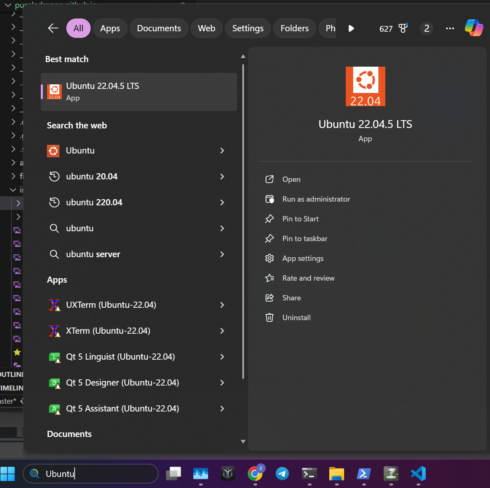
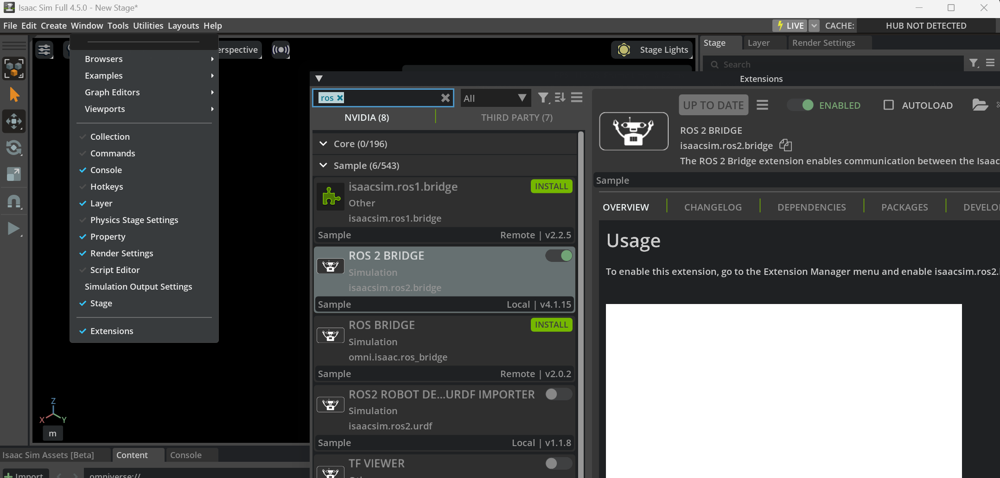

在 Windows 11 上原生安装 ROS 2 会因兼容性和依赖问题变得复杂且容易出错。
为简化配置并保证与 Isaac Sim 的通信顺畅，我使用 WSL（Windows 子系统 for Linux）运行 Ubuntu 22.04，并在其中安装 ROS 2 Humble。

这样可以直接利用 Isaac Sim 的 ROS 2 桥接，该桥接原生支持 ROS 2 Humble。

本指南假设你已从官方 GitHub 发布页下载并安装好 Isaac Sim。

安装 WSL 与 Ubuntu 22.04
======

安装 wsl 和 ubuntu，可能需要一些时间。
```powershell
wsl --install
# 可查看可用版本，推荐 22.04
wsl --list --online
wsl --install -d Ubuntu-22.04
```

安装完成后需要重启电脑！！！

之后在开始菜单搜索「Ubuntu」并运行即可。


首次打开 Ubuntu 时会提示创建 UNIX 用户：
```bash
Installing, this may take a few minutes...
Please create a default UNIX user account:
Enter new UNIX username:
```
设置好用户名和密码后，即可通过终端使用 Ubuntu。

以后要再打开 Ubuntu 终端，在开始菜单搜索「Ubuntu」并运行即可。

在 Ubuntu 22.04 中安装 ROS 2
======

按官方说明操作即可：

https://docs.ros.org/en/humble/Installation/Ubuntu-Install-Debs.html

## 1. 设置 locale

```bash
locale  # 检查是否为 UTF-8

sudo apt update && sudo apt install locales
sudo locale-gen en_US en_US.UTF-8
sudo update-locale LC_ALL=en_US.UTF-8 LANG=en_US.UTF-8
export LANG=en_US.UTF-8

locale  # 再次确认
```

## 2. 配置软件源

```bash
sudo apt install software-properties-common
sudo add-apt-repository universe
```

```bash
sudo apt update && sudo apt install curl -y
export ROS_APT_SOURCE_VERSION=$(curl -s https://api.github.com/repos/ros-infrastructure/ros-apt-source/releases/latest | grep -F "tag_name" | awk -F\" '{print $4}')
curl -L -o /tmp/ros2-apt-source.deb "https://github.com/ros-infrastructure/ros-apt-source/releases/download/${ROS_APT_SOURCE_VERSION}/ros2-apt-source_${ROS_APT_SOURCE_VERSION}.$(. /etc/os-release && echo $VERSION_CODENAME)_all.deb"
sudo dpkg -i /tmp/ros2-apt-source.deb
```

## 3. 安装 ROS 2 包

```bash
sudo apt update
sudo apt install ros-humble-desktop
```

## 4. 可选安装

ROS-Base（最小安装）：通信库、消息包、命令行工具，无 GUI。

```bash
sudo apt install ros-humble-ros-base
```

开发工具：编译器和构建 ROS 包所需工具

```bash
sudo apt install ros-dev-tools
```

## 5. 终端启动时自动加载 ROS

```bash
echo "source /opt/ros/humble/setup.bash" >> ~/.bashrc
```

## 6. 测试 ROS

在一个终端里 source 后运行 C++ talker：

```bash
# 终端 1
source /opt/ros/humble/setup.bash
ros2 run demo_nodes_cpp talker
```

在另一个终端 source 后运行 Python listener：

```bash
# 终端 2
source /opt/ros/humble/setup.bash
ros2 run demo_nodes_py listener
```

Windows 网络设置
======
ROS 2 安装完成后，在 WSL2 中运行下面命令获取 WSL2 的 IP：

```bash
# Ubuntu 终端
hostname -I
```

以管理员身份打开 PowerShell，运行下面命令并记下 Windows 主机的 IPv4 地址：

```bash
# Windows PowerShell
ipconfig /all
```

在 PowerShell 中按实际 IP 设置变量：

```bash
# Windows PowerShell
$Windows_IP = "<WINDOWS_IP>"
$WSL2_IP = "<WSL2_IP>"
```

在 PowerShell 中为 ROS 默认 DDS（FastDDS）使用的端口配置端口转发：

```bash
# Windows PowerShell
netsh interface portproxy add v4tov4 listenport=7400 listenaddress=$Windows_IP connectport=7400 connectaddress=$WSL2_IP
netsh interface portproxy add v4tov4 listenport=7410 listenaddress=$Windows_IP connectport=7410 connectaddress=$WSL2_IP
netsh interface portproxy add v4tov4 listenport=9387 listenaddress=$Windows_IP connectport=9387 connectaddress=$WSL2_IP
```

启用 Isaac Sim 内置 ROS 2 库
======

Windows PowerShell
```bash
# 设置环境变量
$env:isaac_sim_package_path = "cd PATH_TO_ISAAC_SIM"
$env:ROS_DISTRO = "humble"
$env:RMW_IMPLEMENTATION = "rmw_fastrtps_cpp"

# 每个会话只设置一次 !!ONCE!!，避免路径冲突
$env:PATH = "$env:PATH;$env:isaac_sim_package_path\exts\isaacsim.ros2.bridge\humble\lib"

# 启用 ROS 2 桥接并运行 Isaac Sim
& "$env:isaac_sim_package_path\isaac-sim.bat" --/isaac/startup/ros_bridge_extension=isaacsim.ros2.bridge
```


