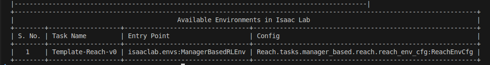

After taking the isaaclab manage-based RL training, I have few understanding about the structure, here to share.

Creating an Isaac Lab Project
======

1. Navigate to the Isaac Lab folder and active the environment
```bash
cd ~/IsaacLab
conda activate env_isaaclab
```
---

2. Run the Isaac Lab script with the --new argument to create the template project:

Linux: 
```bash
./isaaclab.sh --new
```

Windows: 
```bash
.\isaaclab.bat --new
```

3. The template generator will ask you a few questions. In this command-line menu, use arrows to move and the spacebar to select an option, then press enter to choose the option.

- Task type: select External.
- Project path: set this where you’d like, just make note of the folder.
    (I suggest to create in a specific folder that store all of your Project)
- Project name: give the project a name such as Reach
    (It will be the Project folder's name)
- Isaac Lab Workflow: choose the Manager-based | single-agent workflow.
    (Manager is the latest version, more clear structure than direct one)
- RL library: choose skrl for the reinforcement learning library.
- RL algorithms: choose PPO, an abbreviation for Proximal Policy Optimization.

You will got a path structure like this:
```bash
Reach/                                   # Project Name, Use Reach here
├── scripts/                             # Launch/test scripts
│   ├── zero_agent.py                    # Main script for testing agents. $python scripts/zero_agent.py --task Reach --num_envs=10
│   └── randowm_agnet.py                 # Used for train or test.         $python scripts/randowm_agent.py --task Reach  --headless
│   └── list_envs.py                     # Used for seen definded, result to put into --task xxx above.  $python scripts/list_envs.py     
│
├── source/
│   └── Reach/                           # Same as project name
│       ├── Reach/                       # Same as project name, cannot have different envs
│       │   ├── tasks/                   
│       │   │   ├── manager_based/       
│       │   │   │   ├── reach/           # Must same as project name
│       │   │   │   │   ├── __init__.py                 # Regest task here, when add, need to reinstall
│       │   │   │   │   ├── agent/
│       │   │   │   │   │   └── skrl_ppo_cfg.yaml       # Defines the settings and hyperparameters for training our RL agents.
│       │   │   │   │   ├── mdp/                
│       │   │   │   │   │   └── rewards.py              # define reward calculate functions
│       │   │   │   │   └── reach_env_cfg.py            # Most important part, define your RL!
│       │   │   └── ...                  
│       │   └── ...                   
│       └── ...
│
├── README.md
└── ...
```

Install the project
======
Install your external project by running the following command. This installs the package in “editable” mode, which is useful during development. Notice our project name being used at the end of the command.

```bash
python -m pip install -e source/Reach
```

To confirm the project was installed, run this command to list installed environments.
```bash
python scripts/list_envs.py
```

Confirm that our project is listed:


You also will find task Template-Reach-v0 is added into '__init__.py'
```bash
gym.register(
    id="Template-Reach-v0",
    entry_point="isaaclab.envs:ManagerBasedRLEnv",
    disable_env_checker=True,
    kwargs={
        "env_cfg_entry_point": f"{__name__}.reach_env_cfg:ReachEnvCfg",
        "skrl_cfg_entry_point": f"{agents.__name__}:skrl_ppo_cfg.yaml",
    },
)
```

reach_env_cfg.py Structure
======
You will see:

```bash
class ReachSceneCfg(InteractiveSceneCfg)    # Defines the scene setup including robot, objects, table, etc.
class ActionsCfg:                           # Defines which joints are controllable and how (position, velocity, etc.)
class CommandsCfg:                          # Defines goal commands (e.g., target end-effector position)
class ObservationsCfg:                      # Specifies what observations the agent receives each step
class TerminationsCfg:                      # Defines when the episode should terminate
class EventCfg:                             # Events that run during reset (e.g., randomizing initial joint positions)
class RewardsCfg:                           # Defines the reward terms for reinforcement learning
class CurriculumCfg:                        # Curriculum learning: modify difficulty over time

class ReachEnvCfg(ManagerBasedRLEnvCfg):    # Overall configuration for training environments
class ReachEnvCfg_PLAY(ReachEnvCfg):        # Configuration for interactive testing

```