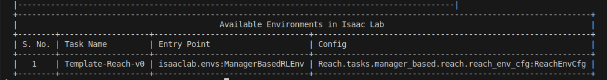

在接触 isaaclab 基于 manager 的 RL 训练后，对整体结构有了一些理解，在此记录分享。

创建 Isaac Lab 项目
======

1. 进入 Isaac Lab 目录并激活环境
```bash
cd ~/IsaacLab
conda activate env_isaaclab
```
---

2. 使用 --new 参数运行 Isaac Lab 脚本，生成模板项目：

Linux：
```bash
./isaaclab.sh --new
```

Windows：
```bash
.\isaaclab.bat --new
```

3. 模板生成器会询问几个问题。在命令行菜单中用方向键移动、空格选择、回车确认。

- Task type：选 External。
- Project path：设置到你想要的路径，记下该文件夹。
    （建议放在专门存放所有项目的目录下）
- Project name：给项目起名，例如 Reach。
    （将作为项目文件夹名）
- Isaac Lab Workflow：选 Manager-based | single-agent workflow。
    （Manager 为最新版本，结构比 direct 更清晰）
- RL library：选 skrl 作为强化学习库。
- RL algorithms：选 PPO（Proximal Policy Optimization 的缩写）。

会得到类似如下的目录结构：
```bash
Reach/                                   # 项目名，此处以 Reach 为例
├── scripts/                             # 启动/测试脚本
│   ├── zero_agent.py                    # 测试 agent 的主脚本。$python scripts/zero_agent.py --task Reach --num_envs=10
│   └── randowm_agnet.py                 # 训练或测试用。         $python scripts/randowm_agent.py --task Reach  --headless
│   └── list_envs.py                     # 查看已定义的环境，结果用于上面的 --task xxx。  $python scripts/list_envs.py     
│
├── source/
│   └── Reach/                           # 与项目名相同
│       ├── Reach/                       # 与项目名相同，不能包含不同 envs
│       │   ├── tasks/                   
│       │   │   ├── manager_based/       
│       │   │   │   ├── reach/           # 必须与项目名相同
│       │   │   │   │   ├── __init__.py                 # 在此注册 task，新增后需重新安装
│       │   │   │   │   ├── agent/
│       │   │   │   │   │   └── skrl_ppo_cfg.yaml       # 定义 RL agent 训练的超参与设置
│       │   │   │   │   ├── mdp/                
│       │   │   │   │   │   └── rewards.py              # 定义 reward 计算函数
│       │   │   │   │   └── reach_env_cfg.py            # 最重要，定义你的 RL 环境！
│       │   │   └── ...                  
│       │   └── ...                   
│       └── ...
│
├── README.md
└── ...
```

安装项目
======
以可编辑模式安装你的外部项目（开发时常用）。注意命令末尾使用你的项目名：

```bash
python -m pip install -e source/Reach
```

确认项目已安装，可运行下列命令列出已安装环境：
```bash
python scripts/list_envs.py
```

确认我们的项目在列表中：


你会看到 Template-Reach-v0 已加入 __init__.py：
```bash
gym.register(
    id="Template-Reach-v0",
    entry_point="isaaclab.envs:ManagerBasedRLEnv",
    disable_env_checker=True,
    kwargs={
        "env_cfg_entry_point": f"{__name__}.reach_env_cfg:ReachEnvCfg",
        "skrl_cfg_entry_point": f"{agents.__name__}:skrl_ppo_cfg.yaml",
    },
)
```

reach_env_cfg.py 结构
======
你会看到：

```bash
class ReachSceneCfg(InteractiveSceneCfg)    # 定义场景：机器人、物体、桌子等
class ActionsCfg:                           # 定义哪些关节可控及方式（位置、速度等）
class CommandsCfg:                          # 定义目标指令（如末端目标位姿）
class ObservationsCfg:                      # 指定每步 agent 接收的观测
class TerminationsCfg:                      # 定义何时结束 episode
class EventCfg:                             # reset 时的事件（如随机初始关节位置）
class RewardsCfg:                           # 定义强化学习的 reward 项
class CurriculumCfg:                        # 课程学习：随时间调整难度

class ReachEnvCfg(ManagerBasedRLEnvCfg):    # 训练环境的总体配置
class ReachEnvCfg_PLAY(ReachEnvCfg):        # 交互测试用配置
```
