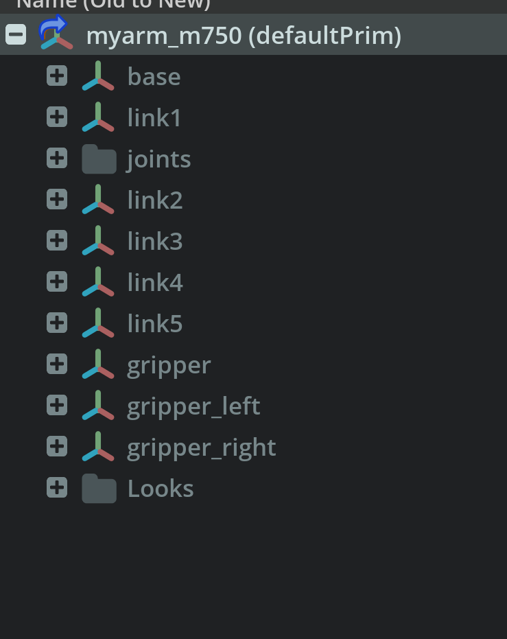
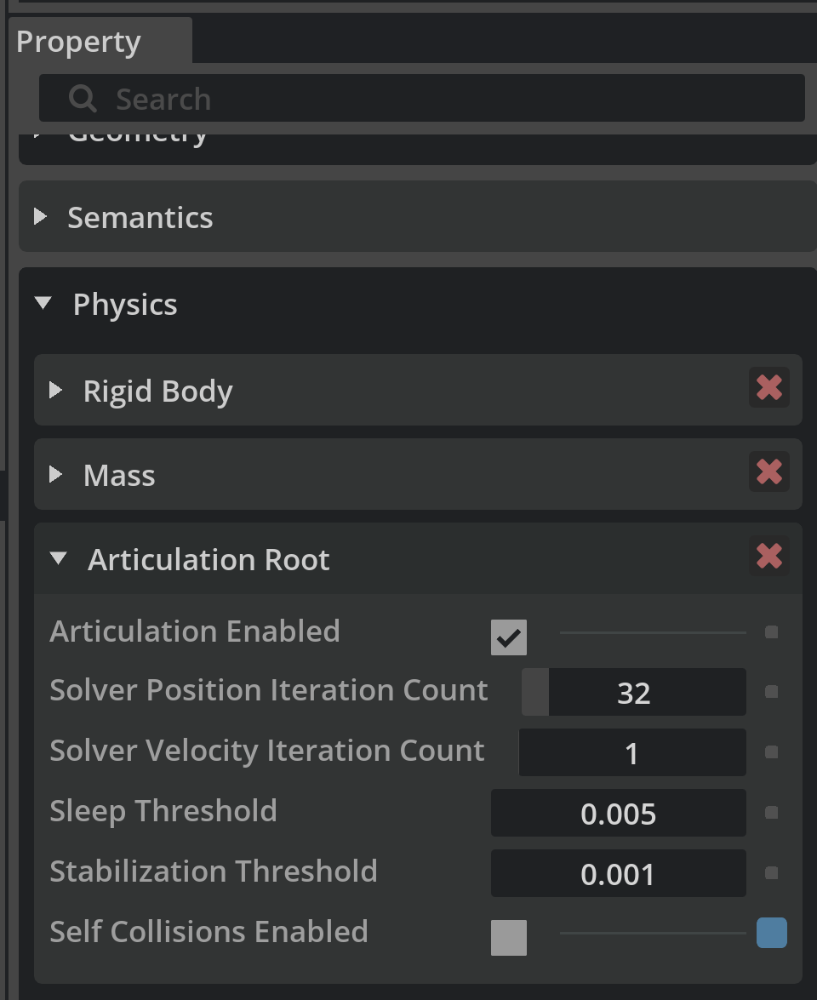

When loading a custom robot (e.g., `myarm_m750`) in **IsaacLab / Isaac Sim**, you may encounter the following error:

```
RuntimeError: Failed to find an articulation when resolving '/World/envs/env_0/myarm_m750'.
Please ensure that the prim has 'USD ArticulationRootAPI' applied.
```

## Root Cause
If you copy and paste your USD file, USD will not be able to find the reference assets path, and causing error.
In Isaac Sim, an *Articulation Root* defines the root of a robot’s physics tree. If it is not correctly configured, IsaacLab cannot recognize your robot as an articulated system.

Common reasons for this error include:
- The URDF was not imported as a referenced, movable model.
- The root prim was not set as the `defaultPrim`.
- The base link was not assigned as the articulation root.
- The USD file was still marked as *Instanceable*, preventing property modification.

---

## Step-by-Step Solution

### 1. Import URDF with Correct Settings 
When importing the URDF, make sure to use **Referenced** model type. This keeps all robot properties under its root prim.
---

If you import the URDF with a *Static Base*, the importer creates a `root_joint` that cannot be deleted and holds the articulation root incorrectly.  
Instead, choose **Moveable Base**.


---

### 3. Debug — Default Prim
When running IsaacLab for reinforcement learning, you may still see the same error.  
After extensive debugging, the correct setup was discovered: **keep only your robot in the stage** (delete `World`, `Light`, etc.).

Initially, I focused too much on setting the correct *Articulation Root*, but the actual issue was a missing `defaultPrim`.  
A yellow warning in the log revealed that the referenced USD file lacked a `defaultPrim`.  
Setting `myarm_m750` as the default prim solved it.

```bash
2025-10-16T23:54:22Z [12,272ms] [Warning] [omni.usd] Warning: in _ReportErrors at line 3172 of /builds/omniverse/usd-ci/USD/pxr/usd/usd/stage.cpp -- In </World/envs/env_8/myarm_m750>: Unresolved reference prim path @/home/purpledragon/lift_cube_m750/source/lift_cube_m750/lift_cube_m750/tasks/manager_based/lift_cube_m750/MyArm750.usd@<defaultPrim> introduced by @anon:0x3bc5ba40:World0.usd@</World/envs/env_0/myarm_m750> (recomposing stage on stage @anon:0x3bc5ba40:World0.usd@ <0x3bc5c3a0>)
```



---

### 4. Debug — Articulation Root
Initially, I set the *Articulation Root* directly on `myarm_m750`, but this produced the following error:

```bash
NotImplementedError: The articulation prim '/World/envs/env_0/myarm_m750' does not have the RigidBodyAPI applied...
```

After moving the *Articulation Root* to the first link (`Base`), the issue was resolved.



---

## ✅ Summary
To summarize:
0. DO NOT copy paste your USD file.
1. Import as **Referenced + Moveable**.
2. Ensure your robot is the **only object** in the stage.
3. Set `myarm_m750` as **defaultPrim**.
4. Apply **ArticulationRootAPI** to the **Base Link** (not the entire robot).

Following these steps removes the articulation error and allows IsaacLab to correctly initialize your robot.
