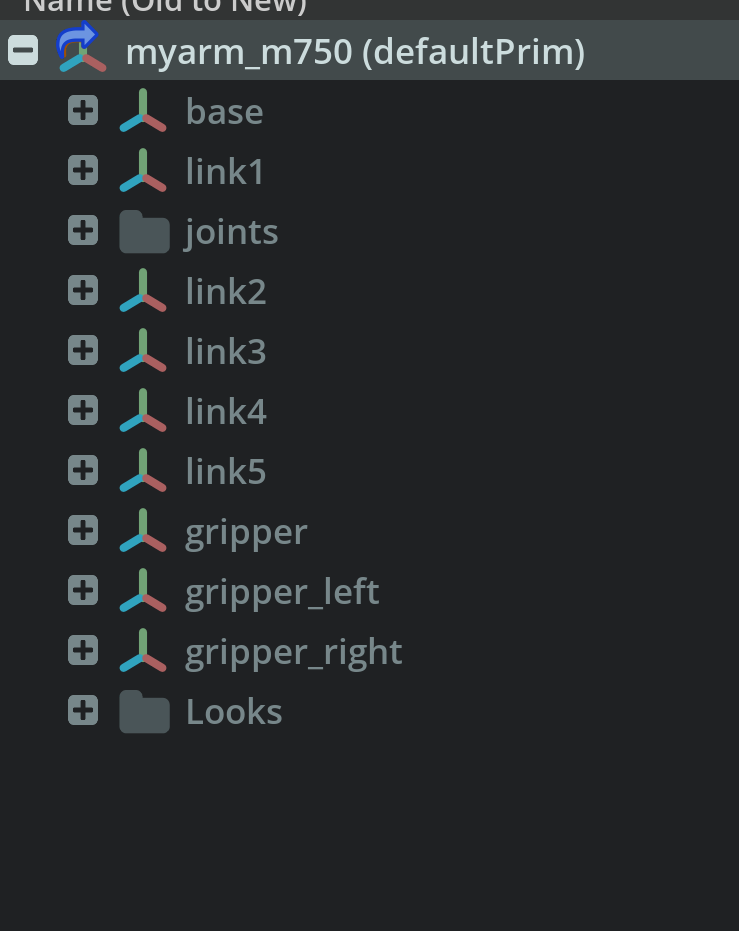
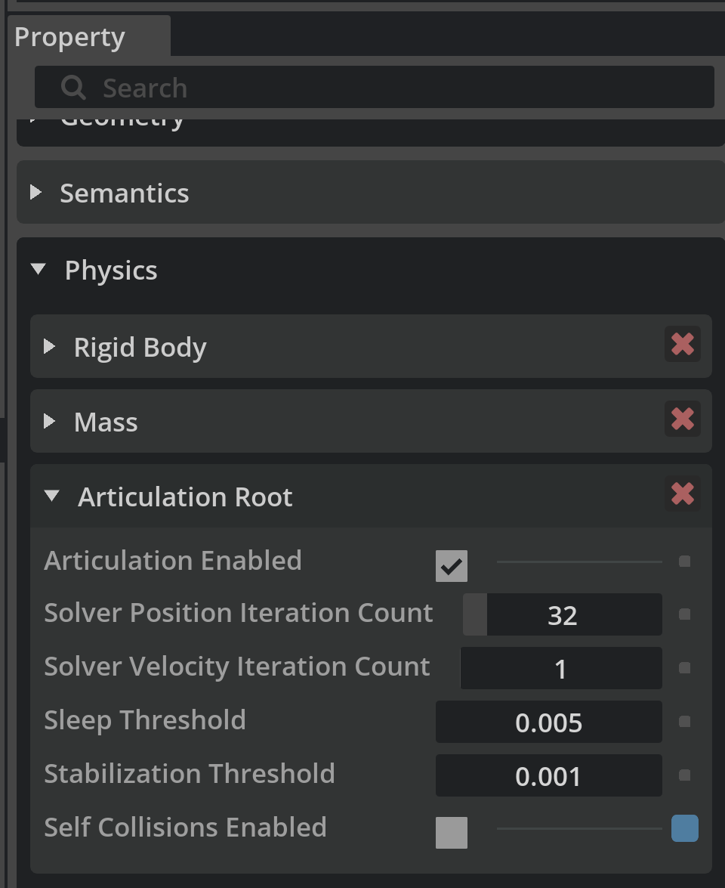

在 **Isaac Lab / Isaac Sim** 中加载自定义机器人（例如 `myarm_m750`）时，可能会遇到以下错误：

```
RuntimeError: Failed to find an articulation when resolving '/World/envs/env_0/myarm_m750'.
Please ensure that the prim has 'USD ArticulationRootAPI' applied.
```

## 原因
如果直接复制粘贴 USD 文件，USD 无法正确解析引用资源路径，会导致该错误。
在 Isaac Sim 中，*Articulation Root* 定义机器人物理树的根。若未正确配置，Isaac Lab 无法将你的机器人识别为关节系统。

常见原因包括：
- URDF 未以可引用、可移动模型方式导入。
- 根 prim 未设为 `defaultPrim`。
- 基座连杆未指定为 articulation root。
- USD 仍被标记为 *Instanceable*，导致属性无法修改。

---

## 逐步解决

### 1. 以正确设置导入 URDF
导入 URDF 时，务必使用 **Referenced** 模型类型，这样机器人的所有属性都保留在其根 prim 下。
---

若以 *Static Base* 导入，导入器会创建一个无法删除的 `root_joint`，并错误地持有 articulation root。
请改为选择 **Moveable Base**。


---

### 3. 调试 — Default Prim
运行 Isaac Lab 做强化学习时，可能仍报同样错误。
经调试后发现正确做法：**场景里只保留你的机器人**（删掉 `World`、`Light` 等）。

一开始我主要在设正确的 *Articulation Root*，实际问题却是缺少 `defaultPrim`。
日志中的黄色警告显示，被引用的 USD 文件没有 `defaultPrim`。
将 `myarm_m750` 设为 default prim 后问题解决。

```bash
2025-10-16T23:54:22Z [12,272ms] [Warning] [omni.usd] Warning: in _ReportErrors at line 3172 of /builds/omniverse/usd-ci/USD/pxr/usd/usd/stage.cpp -- In </World/envs/env_8/myarm_m750>: Unresolved reference prim path @/home/purpledragon/lift_cube_m750/source/lift_cube_m750/lift_cube_m750/tasks/manager_based/lift_cube_m750/MyArm750.usd@<defaultPrim> introduced by @anon:0x3bc5ba40:World0.usd@</World/envs/env_0/myarm_m750> (recomposing stage on stage @anon:0x3bc5ba40:World0.usd@ <0x3bc5c3a0>)
```



---

### 4. 调试 — Articulation Root
最初把 *Articulation Root* 直接设在 `myarm_m750` 上，出现如下错误：

```bash
NotImplementedError: The articulation prim '/World/envs/env_0/myarm_m750' does not have the RigidBodyAPI applied...
```

将 *Articulation Root* 移到第一个 link（`Base`）后，问题解决。



---

## 总结
0. 不要复制粘贴 USD 文件。
1. 以 **Referenced + Moveable** 方式导入。
2. 确保场景中 **只有你的机器人**。
3. 将 `myarm_m750` 设为 **defaultPrim**。
4. 将 **ArticulationRootAPI** 应用到 **Base Link**（不是整台机器人）。

按以上步骤即可消除 articulation 错误，让 Isaac Lab 正确初始化你的机器人。
