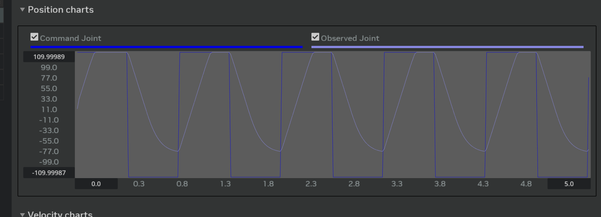
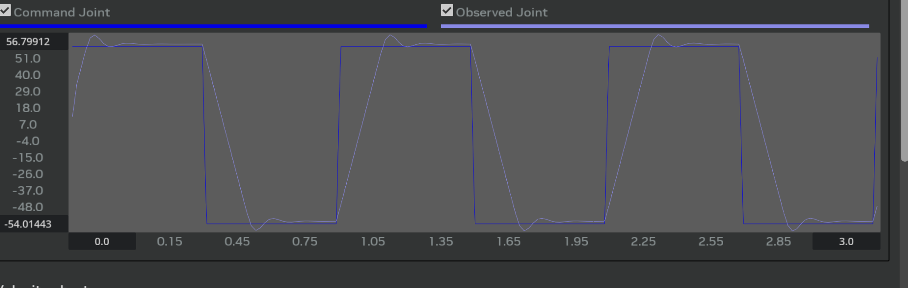
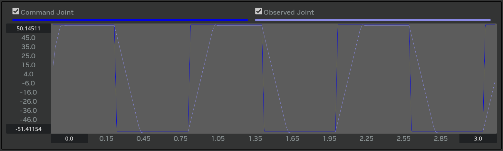
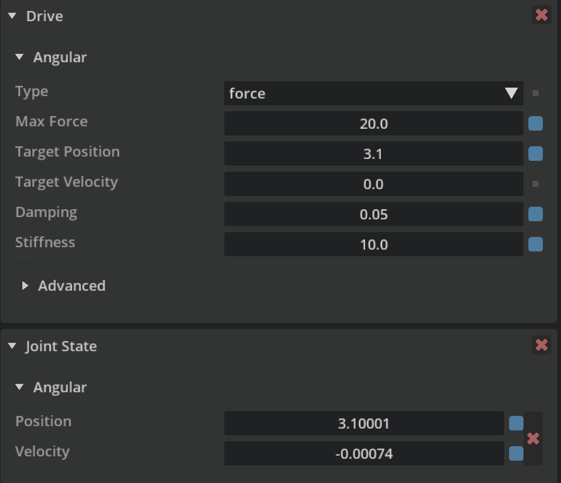

Goal: make the **Observed Joint** follow the **Command Joint** as fast and smooth as a real robot — removing delay, ringing, and steady-state error.

## 0. Initial Situation

- Observed joint was **too slow**, never reached target, and had a **steady offset**.
- Initial parameters:  
  `Max Force = 10`, `Stiffness = 0.05`, `Damping = 0.012`, `Max Actuator Velocity = 60`，`damp ratio = 0.7`.
  

## 1. Round 1
  Problem: Reach the joint limit, cannot reach lower target.
  Solution: Change command to [-50,50], increase stiffness.
  

## 2. Round 2
  Problem: So damping, and have an offset
  Solution: increase damping, and double the force limit (Because of the friction)
  I also found that increasing stiffness or decrease the damping could reduce the offsite trend.
  

## 3. Round 3
 Although there still have a small offset, it only occuered when I run in the Gain Tuner. It will not have offset if I tune in Property.
 (Seems Gain Tuning will cause the offset)
 
