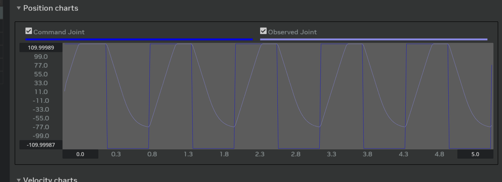
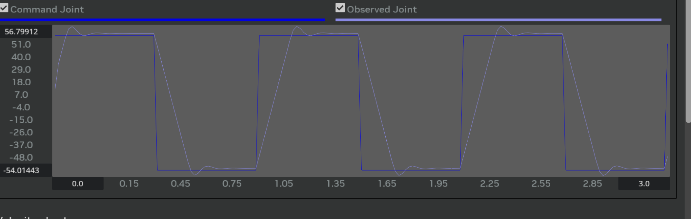
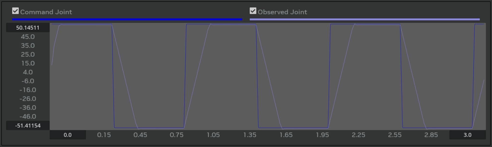
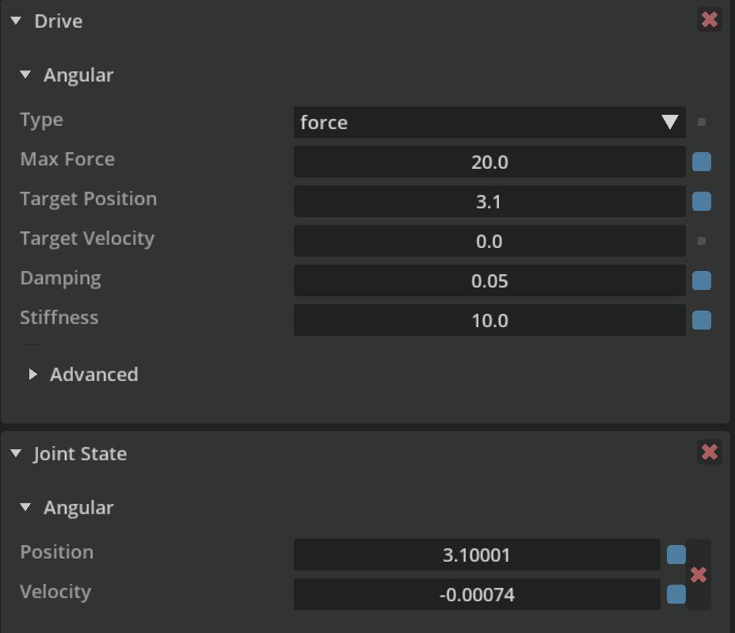

目标：让 **观测关节** 像真实机器人一样快速、平滑地跟随 **指令关节**，消除延迟、振铃和稳态误差。

## 0. 初始情况

- 观测关节 **过慢**，无法到达目标，存在 **稳态偏差**。
- 初始参数：`Max Force = 10`、`Stiffness = 0.05`、`Damping = 0.012`、`Max Actuator Velocity = 60`，`damp ratio = 0.7`。
  

## 1. 第一轮
  问题：触及关节限位，无法到达更低目标。
  解决：将指令范围改为 [-50,50]，提高刚度。
  

## 2. 第二轮
  问题：阻尼过大，存在偏差。
  解决：增大阻尼，并将力限翻倍（考虑摩擦）。
  另外发现，提高刚度或降低阻尼可以减弱偏差趋势。
  

## 3. 第三轮
 虽然仍有小偏差，但仅在 Gain Tuner 中运行时出现；在 Property 中调参则不会出现偏差。
 （推测 Gain Tuning 会导致该偏差）
 
