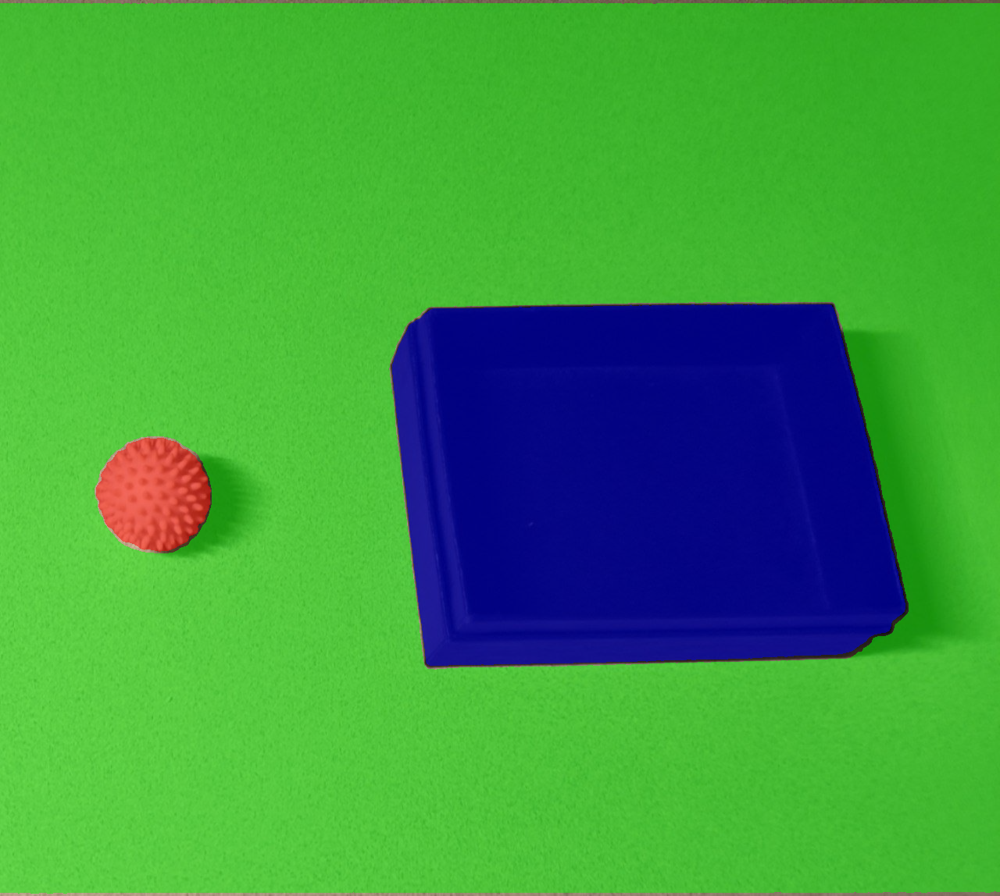
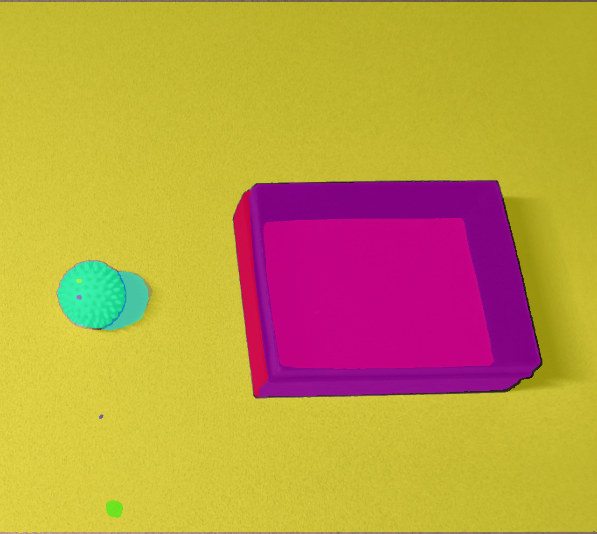

> Convert 2D images into 3D USD assets which could directly used for Isaac Sim.

# SAM 3D Objects - USD Asset Generation Pipeline

Convert 2D images into 3D USD assets which could directly used for Isaac Sim. This pipeline uses LangSplat for image segmentation and SAM 3D Objects for 3D reconstruction.

 

Based on [facebookresearch/sam-3d-objects/pull/38](https://github.com/facebookresearch/sam-3d-objects/pull/38) and [segment-anything-langsplat](https://github.com/minghanqin/segment-anything-langsplat). Tested on Ubuntu 24.04 + RTX 5090.

## Overview

Two-step process:

1. **Stage 1**: Segment objects in images using LangSplat (creates masks)
2. **Stage 2**: Convert masks to 3D USD files with textures and physics

## Stage 1: Image Preprocessing

LangSplat automatically finds objects in images and creates masks. It generates three modes:

- **s** (small): Detailed masks
- **m** (medium): Balanced masks
- **l** (large): Coarse masks (recommended for 3D)

**LangSplat segmentation (l mode) vs default segmentation:**

 | 
:---: | :---:
LangSplat (l mode) | Default


**Input**:
```
input_dir/
  image.png
```

**Output**:
```
output_dir/
  input_dir_name/
    s/
      image.png, 0.png, 1.png, ...
    m/
      image.png, 0.png, 1.png, ...
    l/
      image.png, 0.png, 1.png, ...
    segments_*.png  # Visualizations
```

## Stage 2: 3D Reconstruction

Converts masks into 3D USD files. Each USD file contains:

- **XForm wrapper**: All objects wrapped in XForm primitives
- **Textured mesh**: 3D model with textures
- **Scene scaling**: Properly scaled for your scene
- **Physics**: Rigid body, collision shapes, and mass
- **Default prim**: Ready for USD scene composition
- **Coordinate conversion**: Automatic Y-up to Z-up transform

## Installation
Follow the [setup](assets/setup.md) steps before running the following.

## Usage

### Full Pipeline

Run both stages together:

```bash
python demo.py --image_dir=notebook/images/isaac_lift_ball/ --output_dir=result
```

**Options**:
- `--image_dir`: Folder with `image.png`
- `--output_dir`: Where to save results
- `--segment_mode`: Use `'l'`, `'m'`, or `'s'` (default: `'l'`)
- `--sam_ckpt_path`: Path to SAM checkpoint (default: `checkpoints/samv1/sam_vit_h_4b8939.pth`)

**Output**:
```
result/
  images/
    input_dir_name/
      s/, m/, l/  # Masks for each mode
  usds/
    input_dir_name/
      0.usd, 1.usd, ...  # USD files for each object
```

### Preprocessing Only

Just create masks without 3D reconstruction:

```bash
python preprocess.py --input_dir=notebook/images/isaac_lift_ball/ --output_dir=result --sam_ckpt_path=checkpoints/samv1/sam_vit_h_4b8939.pth
```

**Options**:
- `--input_dir`: Folder with `image.png`
- `--output_dir`: Where to save masks
- `--sam_ckpt_path`: Path to SAM checkpoint

This creates masks in s, m, and l modes only.

## License

Built on:
- [SAM 3D Objects](https://github.com/facebookresearch/sam-3d-objects) - SAM License, [PR #38](https://github.com/facebookresearch/sam-3d-objects/pull/38)
- [segment-anything-langsplat](https://github.com/minghanqin/segment-anything-langsplat) - For preprocessing

## References

- [SAM 3D Objects](https://github.com/facebookresearch/sam-3d-objects)
- [USD Export PR #38](https://github.com/facebookresearch/sam-3d-objects/pull/38)
- [segment-anything-langsplat](https://github.com/minghanqin/segment-anything-langsplat)