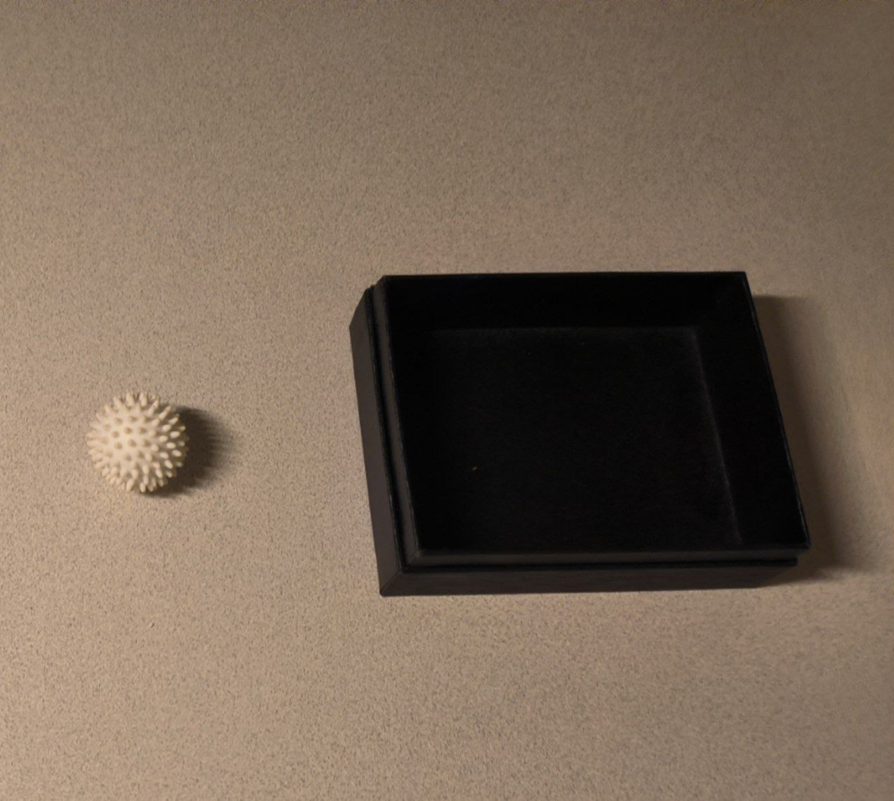
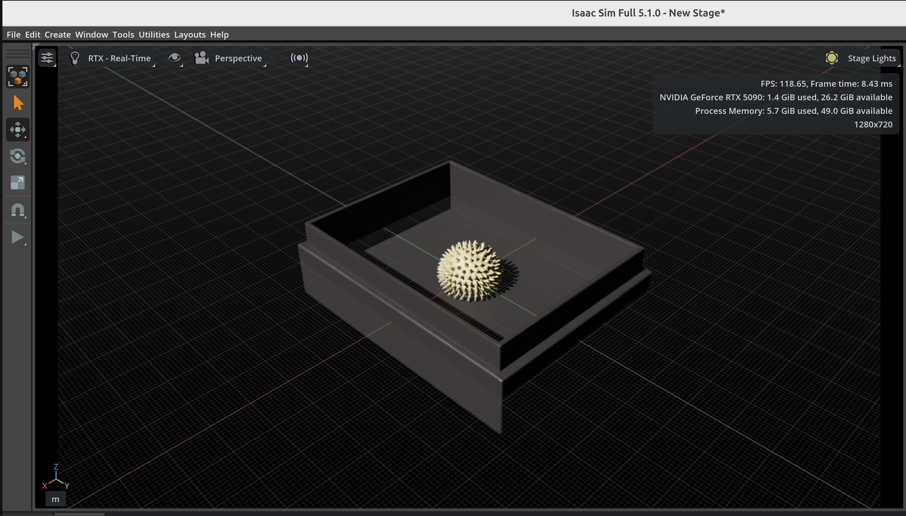

> 将二维图像转为可直接在 Isaac Sim 中使用的 3D USD 资产。

# SAM 3D Objects - USD 资产生成流程

将二维图像转为可直接在 Isaac Sim 中使用的 3D USD 资产。本流程使用 LangSplat 做图像分割，使用 SAM 3D Objects 做三维重建。

 

基于 [facebookresearch/sam-3d-objects/pull/38](https://github.com/facebookresearch/sam-3d-objects/pull/38) 与 [segment-anything-langsplat](https://github.com/minghanqin/segment-anything-langsplat)。在 Ubuntu 24.04 + RTX 5090 上测试。

## 概述

两步流程：

1. **阶段 1**：用 LangSplat 在图像中分割物体（生成 mask）
2. **阶段 2**：将 mask 转为带纹理与物理的 3D USD 文件

## 阶段 1：图像预处理

LangSplat 自动在图像中找物体并生成 mask，支持三种模式：

- **s**（小）：细节更多
- **m**（中）：折中
- **l**（大）：较粗（推荐用于 3D）

**输入**：
```
input_dir/
  image.png
```

**输出**：
```
output_dir/
  input_dir_name/
    s/
      image.png, 0.png, 1.png, ...
    m/
      ...
    l/
      ...
    segments_*.png  # 可视化
```

## 阶段 2：三维重建

将 mask 转为 3D USD。每个 USD 包含：

- **XForm 包装**：所有物体包在 XForm prim 中
- **带纹理网格**：带贴图的 3D 模型
- **场景缩放**：按场景正确缩放
- **物理**：刚体、碰撞形状与质量
- **Default prim**：可直接用于 USD 场景组合
- **坐标转换**：自动 Y-up 转 Z-up

## 安装
运行前请按 [setup](assets/setup.md) 完成环境配置。

## 使用

### 完整流程

一次性跑两阶段：

```bash
python demo.py --image_dir=notebook/images/isaac_lift_ball/ --output_dir=result
```

**选项**：
- `--image_dir`：包含 `image.png` 的目录
- `--output_dir`：结果输出目录
- `--segment_mode`：`'l'`、`'m'` 或 `'s'`（默认 `'l'`）
- `--sam_ckpt_path`：SAM 权重路径（默认 `checkpoints/samv1/sam_vit_h_4b8939.pth`）

### 仅预处理

只生成 mask，不做 3D 重建：

```bash
python preprocess.py --input_dir=notebook/images/isaac_lift_ball/ --output_dir=result --sam_ckpt_path=checkpoints/samv1/sam_vit_h_4b8939.pth
```

## 许可与参考

基于 [SAM 3D Objects](https://github.com/facebookresearch/sam-3d-objects)、[PR #38](https://github.com/facebookresearch/sam-3d-objects/pull/38)、[segment-anything-langsplat](https://github.com/minghanqin/segment-anything-langsplat)。
