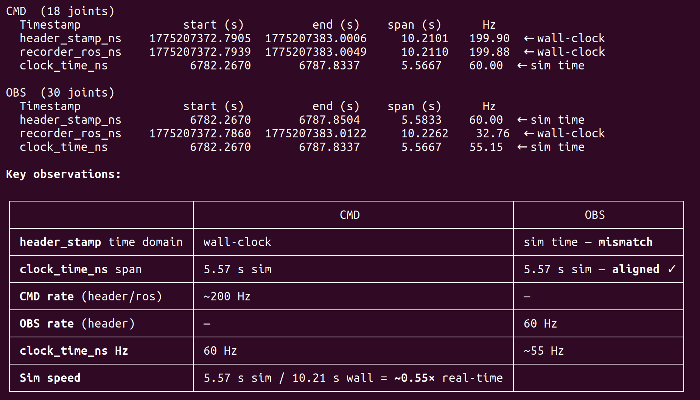
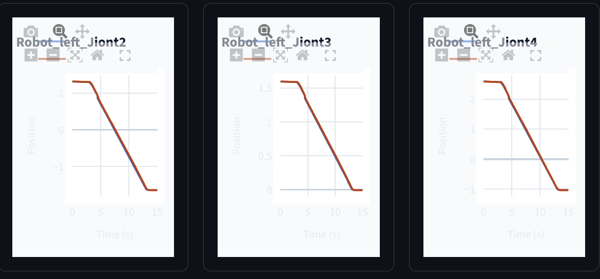

> A recording and visualization tool for comparing MoveIt joint commands with Isaac Sim observed joint positions.

## Overview

This project focuses on a recorder I wrote while debugging a mismatch between simulated and real robot motion. The tool records two streams at the same time:

- MoveIt command positions published to the robot controller
- Isaac Sim observed joint positions returned from the simulation

The goal is to make command-following issues visible instead of relying on visual inspection in Isaac Sim. After recording, the data can be plotted and inspected in a web view, making it easier to compare delay, velocity, and trajectory shape across joints.

## What It Records

The recorder stores the command and observation sequence with timestamps, then exports the data for analysis and browser visualization. This made it possible to compare:

- Whether `obs` follows the shape of `cmd`
- Whether `obs` reaches the same maximum velocity as `cmd`
- Whether Isaac Sim time and ROS / MoveIt time advance at the same rate

## Web Visualization

The visualization overlays command and observation positions so timing and tracking errors are easier to see.



After aligning the Isaac Sim and MoveIt timestamps, the observed trajectory nearly matches the command trajectory.



## Result

The recorder helped identify that the apparent velocity tracking issue was not only a joint velocity limit problem. Isaac Sim and MoveIt were running on different effective timebases:

```text
real world 1s = ROS 1s = MoveIt 1s ~= Isaac Sim 0.55s
```

MoveIt publishes commands according to its own schedule, but it does not know how much simulated time has actually passed inside Isaac Sim. Once the two timestamps were aligned, the command and observation curves became almost identical.

Read the detailed debugging note: [2026-03-31 Isaac Sim / MoveIt timebase analysis](/pages/post_page.html?id=2026-03-31-isaac-moveit-timebase).
