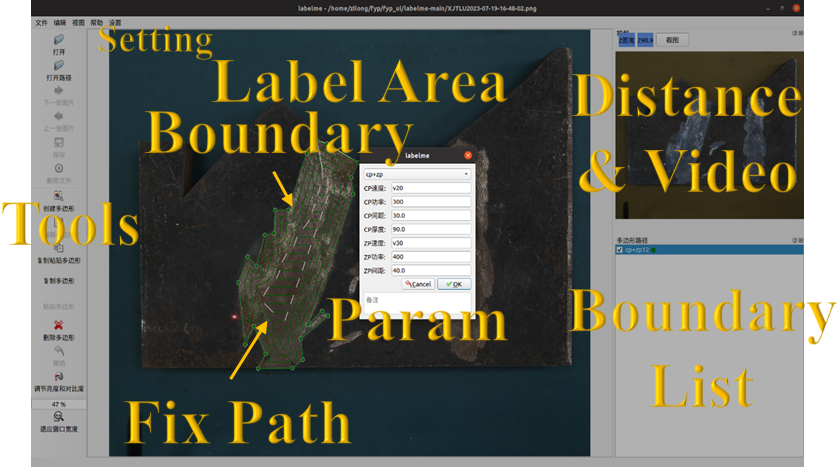
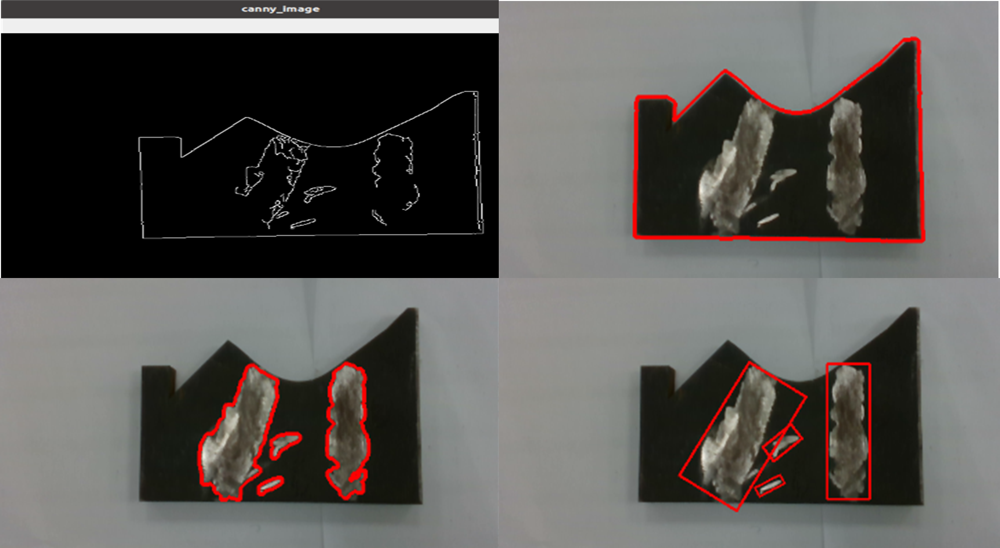
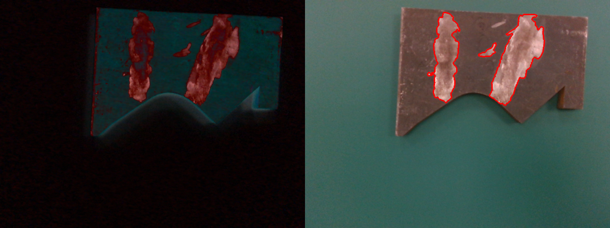
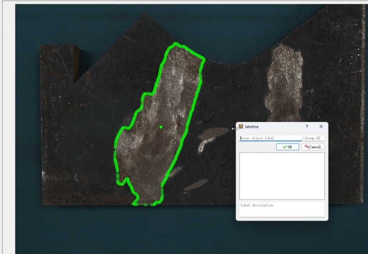
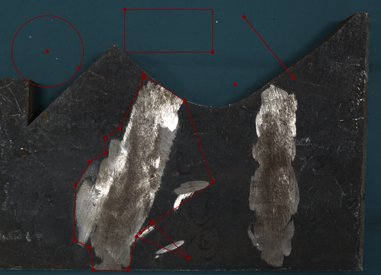
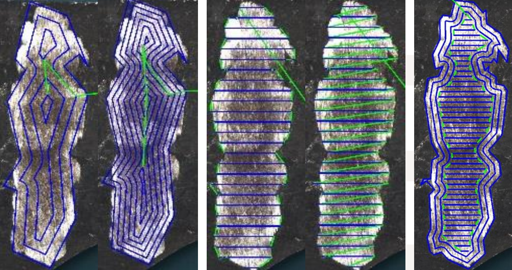
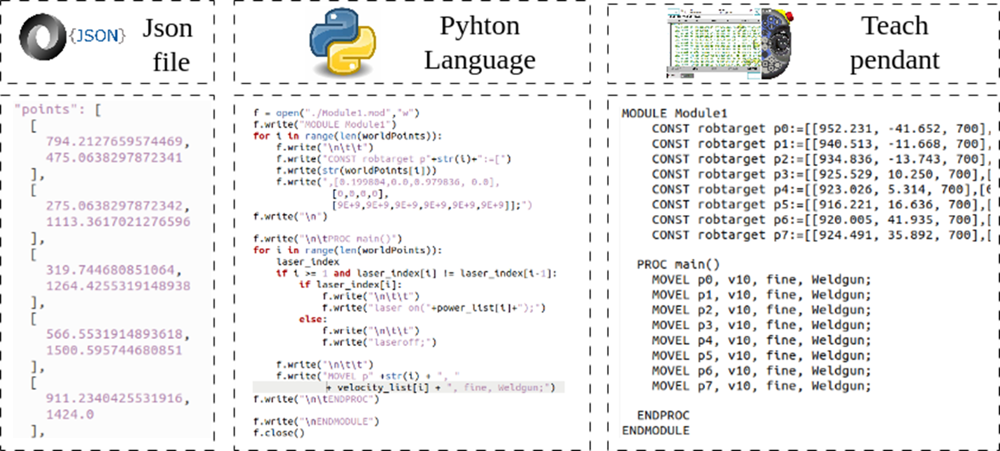
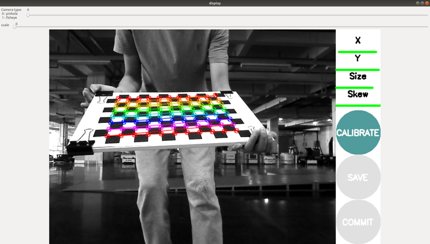
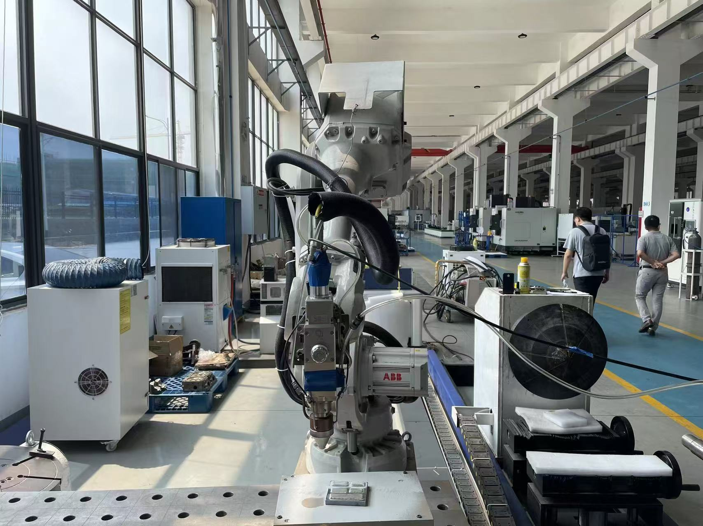
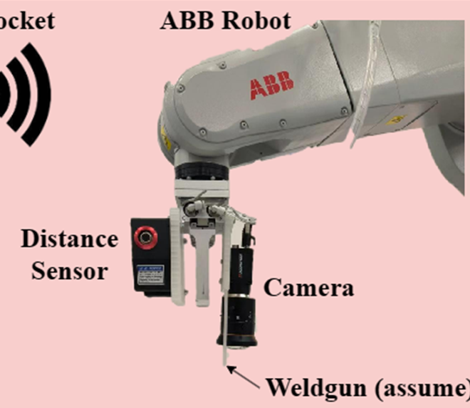

## Overview

Built a vision-based system for 2D planar damage segmentation and automatic laser cladding path planning, from camera image to ABB/FANUC robot code.

Contributions include:
- Heavily modifying **[LabelMe](https://github.com/wkentaro/labelme)** into a full damage-segmentation & path-planning UI
- Supporting auto / semi-auto / manual damage boundary extraction
- Auto-generating laser cladding paths (zigzag / parallel / circular)
- Exposing process parameters (speed, layer height, power, powder feed, layers)
- Allowing full path editing (add/delete/drag keypoints)
- Auto-generating ABB/FANUC robot programs from planned paths
- Performing camera calibration for image-to-robot frame mapping
- Deploying the system on a real robot with an integrated end-effector

## Result

<video src="./assets/demo.mp4" controls muted loop style="max-width:100%"></video>

## Contribution Details

### 1) Turning LabelMe into a Damage & Path Planning GUI

- Took the open-source **[LabelMe](https://github.com/wkentaro/labelme)** annotation tool and heavily customized it:
  - Embedded panels for damage segmentation and path generation
  - Added UI forms to configure path parameters (pattern, spacing, start pose, etc.)
  - Integrated preview of laser cladding paths directly on top of the image
- The modified tool acts as a one-stop interface for:
  - Loading images / scenes
  - Selecting damage regions
  - Generating and editing robot paths

<figure>
  
  <figcaption style="text-align: center;"><em>User Interface</em></figcaption>
</figure>

---

### 2) Multi-Mode Damage Boundary Extraction (Auto / Semi-Auto / Manual)

- Implemented three levels of automation for segmenting damage on a 2D plane:

**Fully Automatic Mode**
- Uses image pre-processing (e.g., brightness compensation) plus **OpenCV**:
- Edge-Based Rule Mode
  - Runs Canny edge detection to extract the outline of the workpiece.
  - Uses contour and geometry rules to locate the region of interest (ROI) on the part.
  - Within each ROI, refines the defect area and draws closed contours / bounding boxes around each damaged region.
- Color-Based Rule Mode
  - Converts the input image into a suitable color space (HSV).
  - Uses color thresholding to separate damaged (discolored) regions from the background.
  - Applies rule-based filtering (area, location) to remove obvious false positives.

<table>
  <tr>
    <td align="center"><b>Edge Based Result</b> </td>
    <td align="center"><b>Color Based Result</b> </td>
  </tr>
  <tr>
    <td></td>
    <td></td>
  </tr>
</table>

**Semi-Automatic Mode (SAM-Based)**
- Integrates [Segment Anything Model](https://github.com/facebookresearch/segment-anything):
  - User clicks a few points indicating the defect region
  - Model returns a high-quality segmentation mask / contour
- Greatly reduces manual workload while remaining robust to lighting and texture changes.

**Manual Mode (LabelMe-Style)**
- Preserves and extends LabelMe’s original annotation capabilities:
  - Polygon
  - Rectangle
  - Line
  - Circle

---

### 3) Automatic Path Generation (Zigzag / Parallel / Circular) with Laser Control

- Once a defect boundary is available, the system automatically fills the interior with a laser cladding pattern:
  - **Zigzag** pattern for simple, dense coverage
  - **Parallel / contour-parallel** style infill for following the defect shape
  - **Circular** patterns for round or localized defects
- Incorporates logic for **laser on/off control**:
  - Laser ON for cladding (blue line)
  - Laser OFF during rapid moves / transitions (green line)
  
  
<figure>
  
  <figcaption style="text-align: center;"><em>1) CP paths with Different Margin 2) Two kinds of ZP paths 3) ZP + CP Path</em></figcaption>
</figure>

---

### 4) Process Parameter Configuration & Multi-Layer Support

- Exposes all key process parameters in the GUI:
  - Travel speed
  - Layer height
  - Number of layers (multi-layer printing)
  - Laser power
  - Powder feed rate
- Allows users to:
  - Configure different parameters per job
  - Plan multi-layer cladding over the same damage region

---

### 5) Interactive Path Editing (Add / Delete / Drag Keypoints)

- After automatic path generation, users can modify paths directly:
  - **Add** keypoints to refine local shape
  - **Delete** keypoints to simplify path
  - **Drag** keypoints to fine-tune positions
- Provides a CAD-like editing workflow on top of the automatically generated path:
  - Combines algorithmic planning with expert manual refinement, helps avoid collisions or undesired motions in special cases

---

### 6) Automatic ABB / FANUC Robot Code Generation

- Converts planned paths and process parameters into **robot programs**, e.g.:
  - ABB RAPID format
  - FANUC-compatible motion instructions
- Automatically:
  - Transforms image-space coordinates into robot coordinates
  - Inserts the appropriate speed, motion type, and I/O commands for laser on/off
- Eliminates the need for manual point teaching or hand-written coordinate tables.
  
<figure>
  
  <figcaption style="text-align: center;"><em> Points in pixel using python generate path code for robot arm.</em></figcaption>
</figure>

---

### 7) Camera Calibration & Coordinate Mapping

- Performed **camera calibration** to obtain intrinsic and extrinsic parameters:
  - Corrects lens distortion
  - Establishes mapping from pixel coordinates to real-world coordinates
- Both 9-point calibration and checkerboard calibration were used, and the checkerboard method was ultimately selected.
  

- The calibration accuracy is high, with an error of less than 1.5 mm along the x-axis and less than 3 mm along the y-axis.
  <video src="./assets/calibrate_result.mp4" controls muted loop style="max-width:50%"></video>
---

### 8) Real-World Deployment on a Robotic System

- Deployed the entire pipeline on a **real robot + camera + laser cladding** setup successfully.
  
 
---

### 9) End-Effector Design & Integration

- Designed and 3D printed a custom **end-effector** that can host:
  - Camera
  - Distance sensor
  - Laser cladding tool
  

