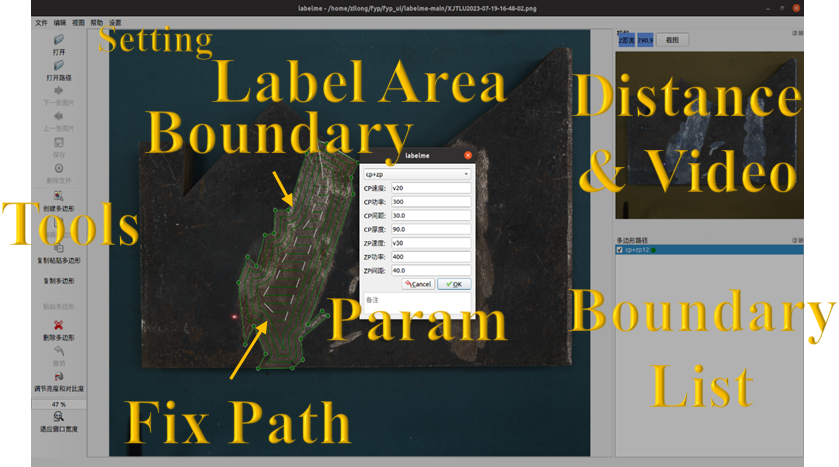
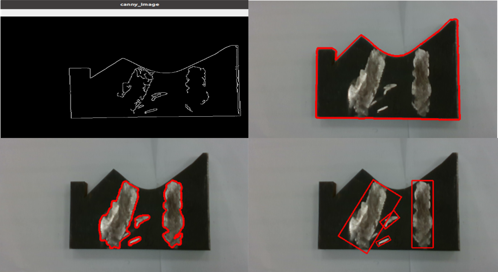
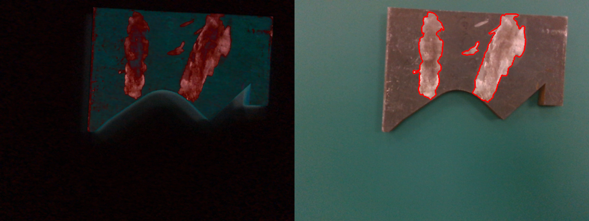
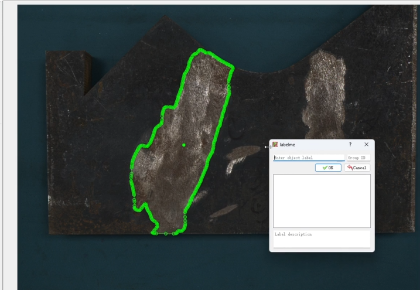
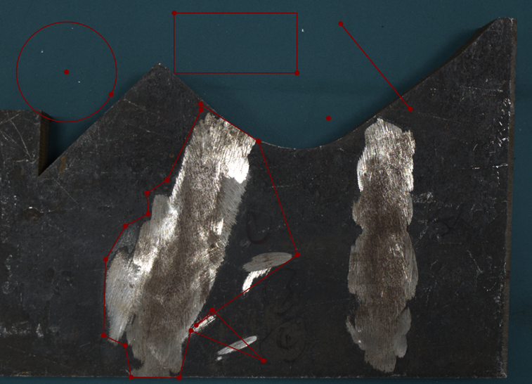
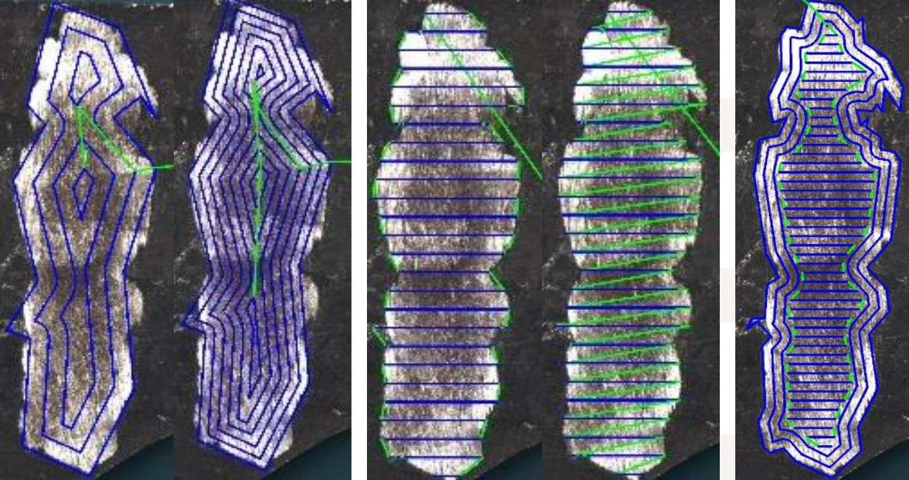
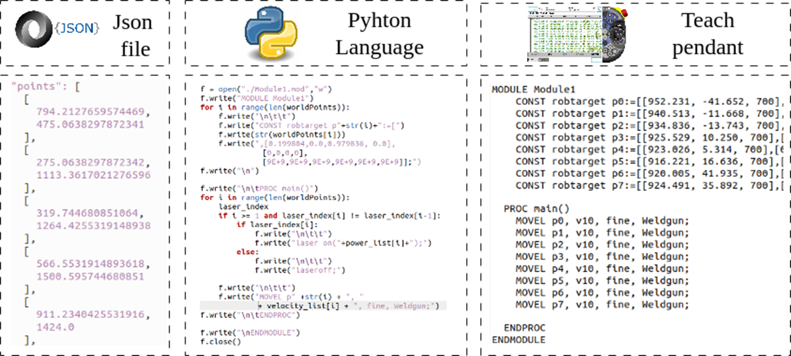
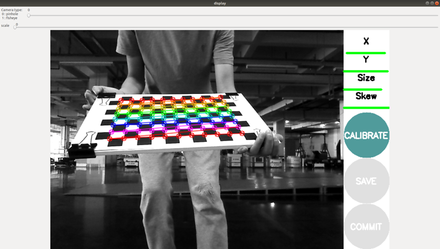
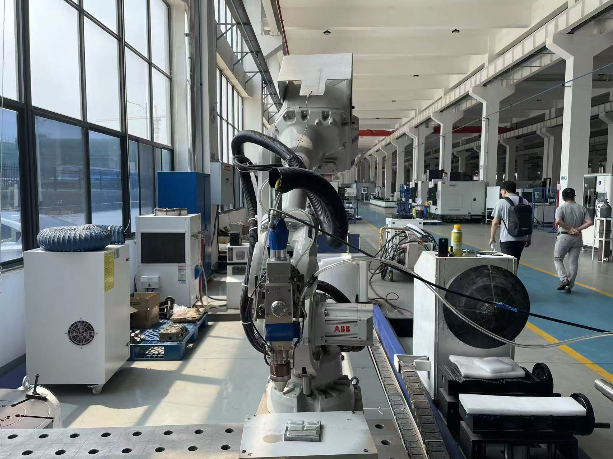
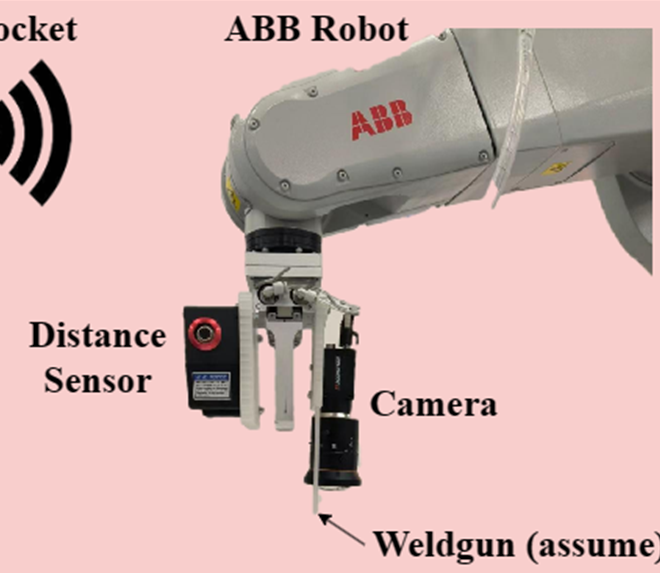

## 概述

搭建了从相机图像到 ABB/FANUC 机器人代码的视觉驱动系统，完成二维平面损伤分割与自动激光熔覆路径规划。

主要工作包括：
- 深度改造 **[LabelMe](https://github.com/wkentaro/labelme)**，形成完整的损伤分割与路径规划界面
- 支持自动 / 半自动 / 手动损伤边界提取
- 自动生成激光熔覆路径（之字形 / 平行 / 环形）
- 暴露工艺参数（速度、层高、功率、送粉量、层数）
- 支持完整路径编辑（增删拖关键点）
- 从规划路径自动生成 ABB/FANUC 机器人程序
- 进行相机标定，实现图像到机器人坐标系的映射
- 在真实机器人与集成末端执行器上部署整套系统

## 效果

<video src="./assets/demo.mp4" controls muted loop style="max-width:100%"></video>

## 详细贡献

### 1) 将 LabelMe 改造成损伤与路径规划 GUI

- 基于开源 **[LabelMe](https://github.com/wkentaro/labelme)** 标注工具进行深度定制：
  - 嵌入损伤分割与路径生成面板
  - 增加路径参数配置表单（图案、间距、起始位姿等）
  - 在图像上直接预览激光熔覆路径
- 改造后的工具作为一站式界面：加载图像/场景、选择损伤区域、生成与编辑机器人路径

<figure>
  
  <figcaption style="text-align: center;"><em>用户界面</em></figcaption>
</figure>

---

### 2) 多模式损伤边界提取（自动 / 半自动 / 手动）

- 在二维平面上实现三种自动化程度的损伤分割：

**全自动模式**
- 结合图像预处理（如亮度补偿）与 **OpenCV**：
- 基于边缘的规则模式
  - 使用 Canny 边缘检测提取工件轮廓，结合轮廓与几何规则定位零件上的感兴趣区域（ROI），在 ROI 内细化缺陷并绘制闭合轮廓/包围框。
- 基于颜色的规则模式
  - 将图像转换到合适色彩空间（HSV），用颜色阈值分离损伤（变色）区域与背景，并用规则过滤（面积、位置）去除明显误检。

<table>
  <tr>
    <td align="center"><b>基于边缘结果</b> </td>
    <td align="center"><b>基于颜色结果</b> </td>
  </tr>
  <tr>
    <td></td>
    <td></td>
  </tr>
</table>

**半自动模式（基于 SAM）**
- 集成 [Segment Anything Model](https://github.com/facebookresearch/segment-anything)：用户点击少量点标出缺陷区域，模型返回高质量分割掩码/轮廓，在保证鲁棒性的同时大幅减少人工标注。

**手动模式（LabelMe 风格）**
- 保留并扩展 LabelMe 的标注方式：多边形、矩形、线段、圆。

---

### 3) 自动路径生成（之字形 / 平行 / 环形）与激光开关控制

- 获得损伤边界后，系统自动在内部填充激光熔覆轨迹：
  - **之字形**：简单、密铺
  - **平行/轮廓平行**：沿缺陷形状走线
  - **环形**：适用于圆形或局部缺陷
- 包含 **激光开/关** 逻辑：熔覆段为激光开启（蓝线），快速空走与过渡为激光关闭（绿线）。

<figure>
  
  <figcaption style="text-align: center;"><em>1) 不同边距的 CP 路径 2) 两种 ZP 路径 3) ZP + CP 路径</em></figcaption>
</figure>

---

### 4) 工艺参数配置与多层支持

- 在 GUI 中暴露关键工艺参数：行走速度、层高、层数（多层）、激光功率、送粉速率。
- 支持按任务配置不同参数、在同一损伤区域规划多层熔覆。

---

### 5) 交互式路径编辑（添加 / 删除 / 拖拽关键点）

- 自动生成后可直接修改路径：**添加**关键点细化局部形状、**删除**关键点简化路径、**拖拽**关键点微调位置。
- 在自动路径之上提供类 CAD 的编辑流程，结合算法规划与人工微调，便于在特殊情况下避免碰撞或异常运动。

---

### 6) 自动生成 ABB / FANUC 机器人代码

- 将规划路径与工艺参数转换为 **机器人程序**，如 ABB RAPID、FANUC 兼容运动指令。
- 自动将图像坐标变换到机器人坐标，并插入速度、运动类型与激光开/关 I/O 指令，无需手教点或手写坐标表。

<figure>
  
  <figcaption style="text-align: center;"><em>用 Python 将像素点生成机械臂路径代码</em></figcaption>
</figure>

---

### 7) 相机标定与坐标映射

- 进行 **相机标定** 获取内参与外参，校正镜头畸变，建立像素坐标到真实世界坐标的映射。
- 使用过 9 点标定与棋盘格标定，最终采用棋盘格方案。
  

- 标定精度较高，x 轴误差小于 1.5 mm，y 轴小于 3 mm。
  <video src="./assets/calibrate_result.mp4" controls muted loop style="max-width:50%"></video>
---

### 8) 在真实机器人系统上的部署

- 在 **真实机器人 + 相机 + 激光熔覆** 设备上成功部署完整流程。
  

---

### 9) 末端执行器设计与集成

- 设计并 3D 打印定制 **末端执行器**，可安装：相机、距离传感器、激光熔覆头。
  
