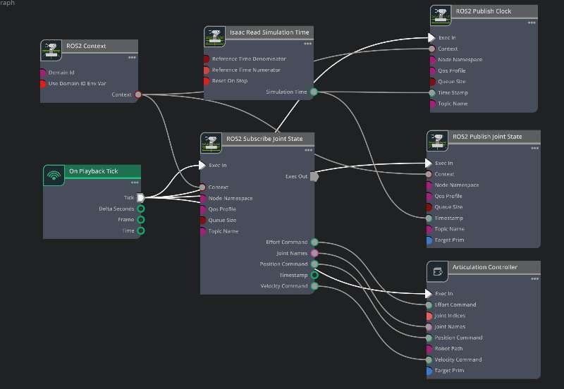

> 使用 MoveIt + ROS 2 控制 SO-ARM101 机械臂，并通过基于 topic 的 ros2_control 与 Isaac Sim 连接。

## 演示
<video src="./assets/demo.mp4" controls muted loop style="max-width:100%"></video>

## 简介

本项目按教程完成：  
<https://lycheeai-hub.com/project-so-arm101-x-isaac-sim-x-isaac-lab-tutorial-series/so-arm101-moveit-in-isaac-sim-with-ros2>

在 **Isaac Sim** 内完成 **SO-ARM101** 的 MoveIt 控制流程，包括：
- 通过 MoveIt Setup Assistant 配置规划场景与控制器  
- 通过 `topic_based_ros2_control` 与 Isaac Sim 的 Action Graph 连接  

## 安装 MoveIt 与 ros2_control 包（ROS 2 Jazzy）

在 ROS 2 工作空间的 `src` 目录下：

```bash
sudo apt update
sudo apt install \
  ros-jazzy-moveit \
  ros-jazzy-ros2-control \
  ros-jazzy-ros2-controllers \
  ros-jazzy-gripper-controllers \
  ros-jazzy-topic-based-ros2-control
```

## MoveIt Setup Assistant
```bash
ros2 launch moveit_setup_assistant setup_assistant.launch.py
```

## 修复 MoveIt 生成的 joint_limits.yaml 问题
    确保所有数值为 float，不要用整型。

## ros2_control 配置
在 SO-ARM 的 URDF 中增加或修改 ros2_control 块，使用 topic_based_ros2_control 并匹配 Isaac Sim 的 topic：
```xml
<hardware>
    <!-- 仿真中使用基于 topic 的控制 -->
    <!-- plugin>mock_components/GenericSystem</plugin -->
    <plugin>topic_based_ros2_control/TopicBasedSystem</plugin>

    <!-- 与 Isaac Sim Action Graph 对应的 topic -->
    <param name="joint_states_topic">/isaac_joint_states</param>
    <param name="joint_commands_topic">/isaac_joint_command</param>
</hardware>
  ```
## 在 moveit_controllers.yaml 中为控制器添加 action 配置
```yaml
action_ns: follow_joint_trajectory
default: true
```

## Isaac Sim Action Graph 配置
  

## 运行 MoveIt 演示
```bash
ros2 launch so_arm_moveit_config demo.launch.py
isaacsim
```
