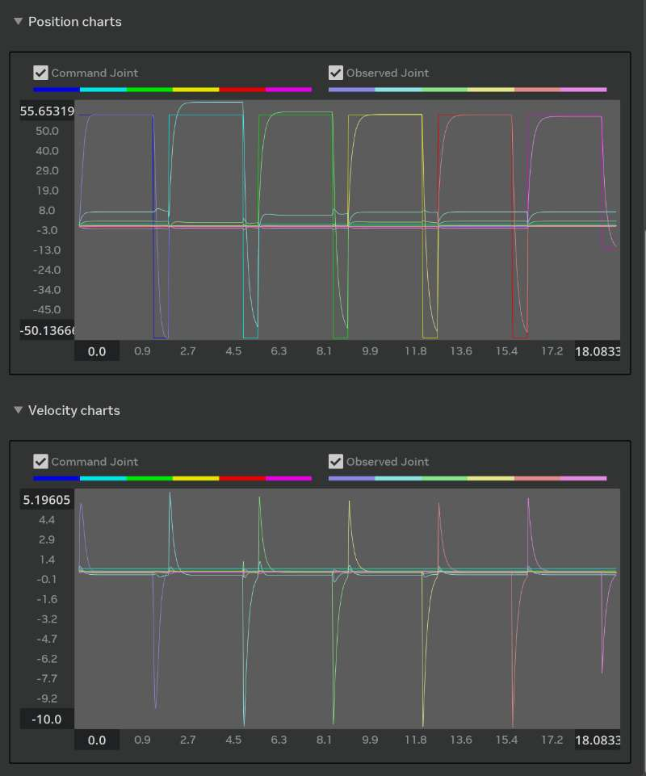
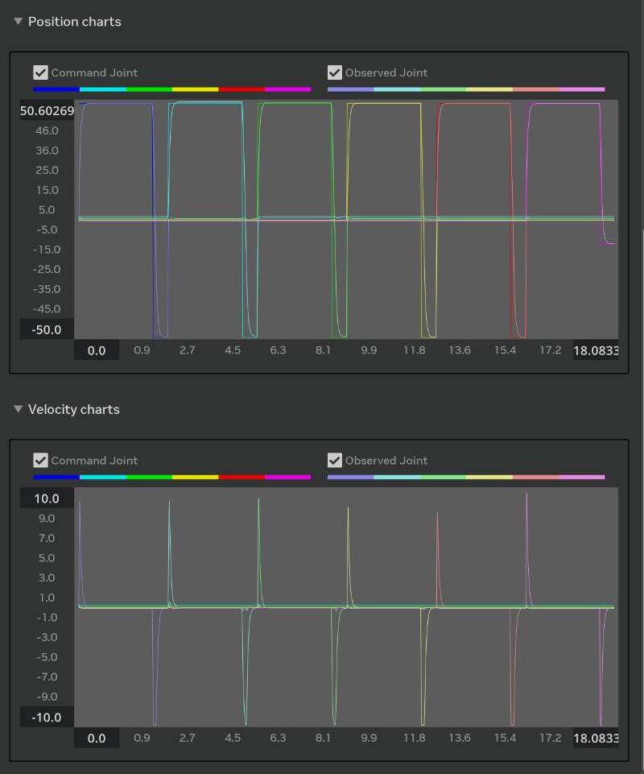
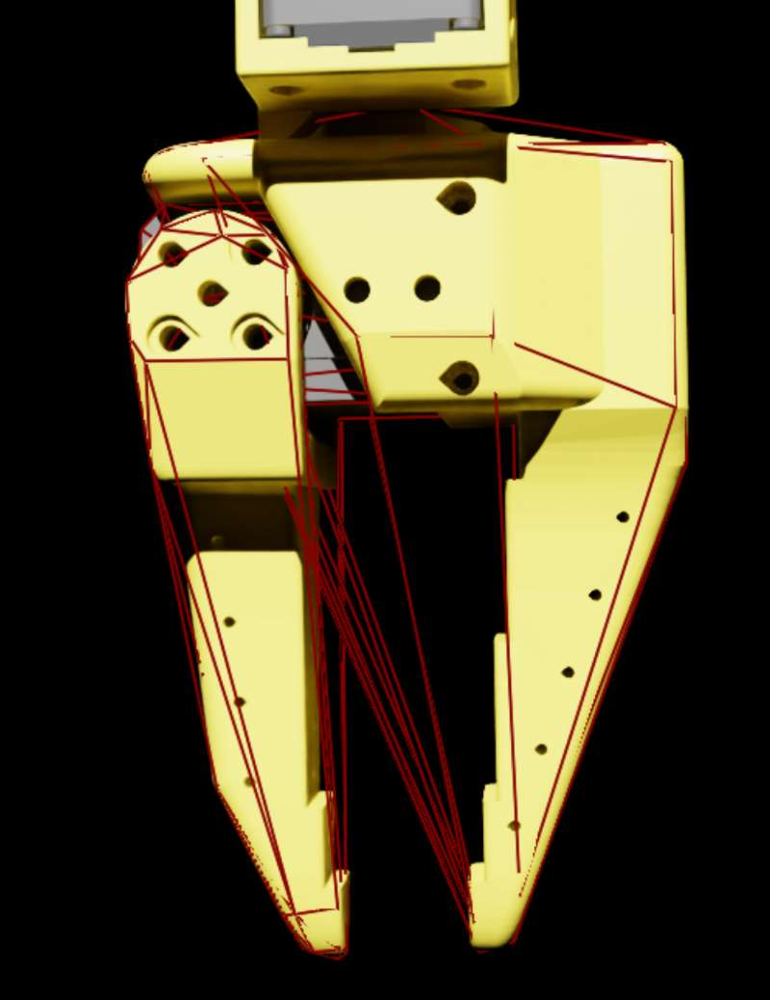
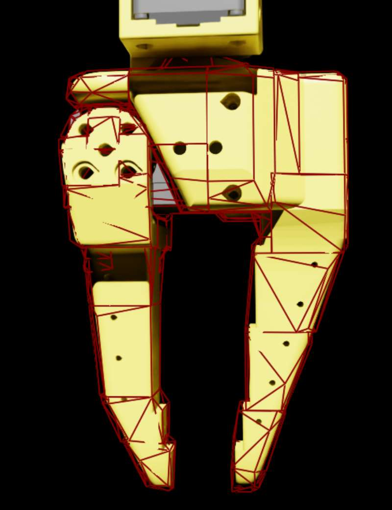
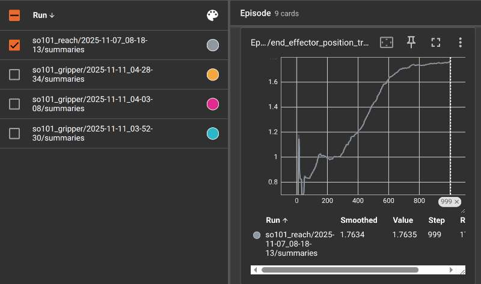
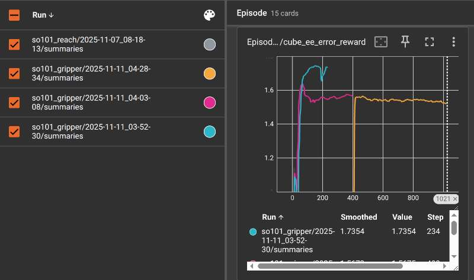

## Overview
Trained an RL policy in IsaacLab (manage-based environment) for the SO101 gripper to grasp and lift a cube.
Contribution include:
- Reporting a ROS2 to USD import issue
- Fixing missing `ArticulationRootAPI` after URDF→USD
- Stiffness/damping tuning with a gain tuner
- Updating gripper collision approximation for stabler contacts
- Adding materials and friction to reduce slip
- Balancing max force/stiffness/damping to minimize penetration
- Mitigating post-grasp jitter near the target
- Designing a stepwise reward schedule
- Providing a multi-run TensorBoard loader for comparisons

## Result
<video src="./assets/success.mp4" controls muted loop style="max-width:100%"></video>

## Contribution Details

### 1) ROS 2 USD import issue
  Link: https://github.com/isaac-sim/IsaacSim/issues/261  
- Reproduced and reported a bug when importing USD via a ros2 node.  


### 2) URDF→USD missing ArticulationRootAPI
  Link: https://github.com/isaac-sim/IsaacLab/issues/959  
- Step by step guide how to set DefaultPrim and Articulation Root for the `usd` assets.
  

### 3) Stiffness/Damping Tuning
- **Accuracy:** After tuning, position tracks the command much closer.
- **Stability:** Overshoot and ringing are greatly reduced.
- **Speed:** Faster rise and settle times.
- **Lag:** Less delay between command and observed motion.

<table>
  <tr>
    <td align="center"><b>Before Tuning</b></td>
    <td align="center"><b>After Tuning</b></td>
  </tr>
  <tr>
    <td></td>
    <td></td>
  </tr>
</table>


### 4) Gripper Collision Approximation Update

- Switched to a more suitable approximation: **convex decomposition**.
- **Benefits:** tighter fit around links, fewer phantom/ghost collisions, cleaner contact points, and more reliable grasp planning.

<table>
  <tr>
    <td align="center"><b>Before</b> (coarse triangles)</td>
    <td align="center"><b>After</b> (convex decomposition)</td>
  </tr>
  <tr>
    <td></td>
    <td></td>
  </tr>
</table>

### 5) Materials and friction setup
- Assigned materials to gripper and cube; tuned static/dynamic friction to limit slip.  

### 6) Effect of Max-Force / Stiffness Tuning

- **Before tuning:** After the gripper grasps the cube, a small pose offset appears. Due to numerical/compute error, the larger the max force or stiffness, the more noticeable the offset.
- **After tuning:** The offset is almost imperceptible to the naked eye.

    <video src="assets/before_tune_sd.mp4" controls muted loop style="max-width:100%"></video>

### 7) Post-grasp jitter mitigation
- Further stiffness/damping adjustments targeted jitter near the goal. Verified in play mode before long training jobs.
<table>
  <tr>
    <td align="center"><b>Before</b> (visible jitter) </td>
    <td align="center"><b>After</b> (Much more stable)</td>
  </tr>
  <tr>
    <td><video src="assets/before tune stiffness.mp4" controls muted loop style="max-width:400px"></video></td>
    <td><video src="assets/after_tune stiffness.mp4" controls muted loop style="max-width:400px"></video></td>
  </tr>
</table>


### 8) Stepwise reward design
- Reach → align → lift → reach.  
- Purpose: speed early learning and stabilize late-stage precision.

```python
class RewardsCfg:
    """Reward terms for the MDP."""

    cube_ee_error_reward = RewTerm(
        func=mdp.cube_ee_error_tanh,
        weight=2,
        params={"asset_cfg1": SceneEntityCfg("robot", body_names=["gripper"]), "asset_cfg2": SceneEntityCfg("cube"), "std": 0.4},
    )
    cube_ee_error_reward_tanh = RewTerm(
        func=mdp.cube_ee_error_tanh,
        weight=5,
        params={"asset_cfg1": SceneEntityCfg("robot", body_names=["gripper"]), "asset_cfg2": SceneEntityCfg("cube"), "std": 0.08},
    )
    
    cube_lift_reward1 = RewTerm(
        func=mdp.cube_lift_reward,
        weight=5,
        params={"asset_cfg": SceneEntityCfg("cube"), "min_height": 0.016},
    )
    
    cube_lift_reward2 = RewTerm(
        func=mdp.cube_lift_reward,
        weight=15,
        params={"asset_cfg": SceneEntityCfg("cube"), "min_height": 0.02},
    )

    cube_goal_distance = RewTerm(
        func=mdp.cube_goal_distance,
        weight=4,
        params={"asset_cfg": SceneEntityCfg("robot", body_names=["gripper"]), 
        "cube_cfg":"cube",
        "std": 0.4, "min_height": 0.02,
        "command_name": "target_pose"
        },
    )   
    cube_goal_distance_tanh = RewTerm(
        func=mdp.cube_goal_distance,
        weight=10,
        params={"asset_cfg": SceneEntityCfg("robot", body_names=["gripper"]), 
        "cube_cfg":"cube",
        "std": 0.08, "min_height": 0.02,
        "command_name": "target_pose"
        },
    )
```

### 9) Multi-run TensorBoard loader
- Script to load and compare multiple runs.  
- Could be Used for A/B tests on materials, collision approximations, and gain sets.
Before: Only one log.

After: Could load and compare multiple runs.  



## TODO
Sim 2 Real
Add Camera
