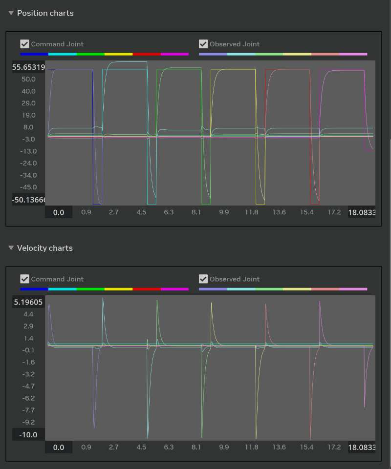
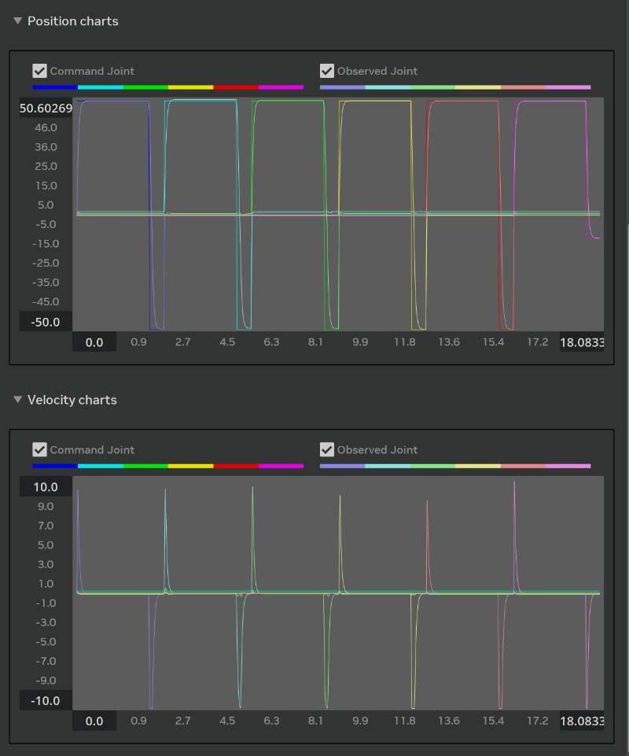
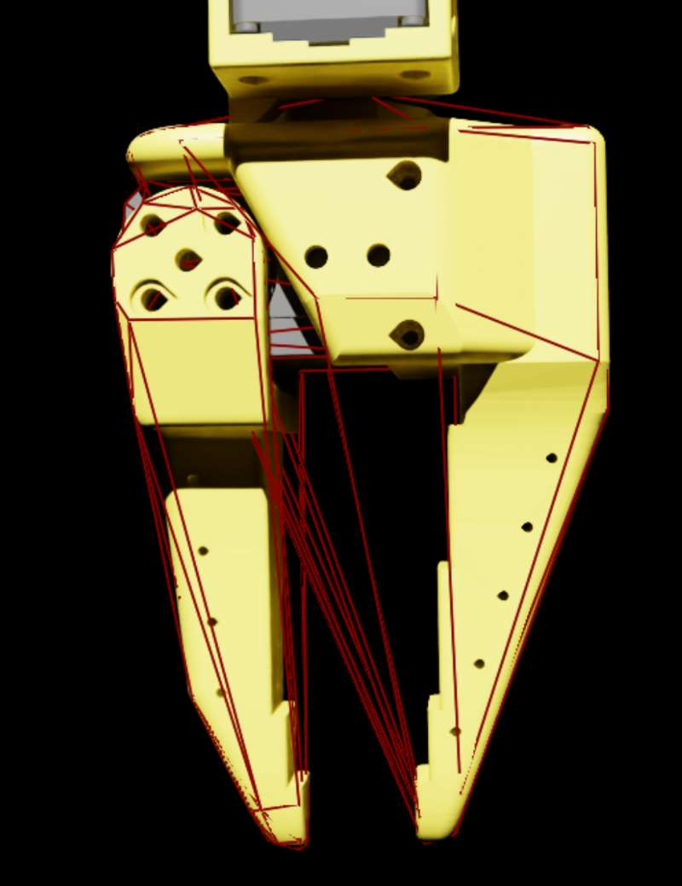
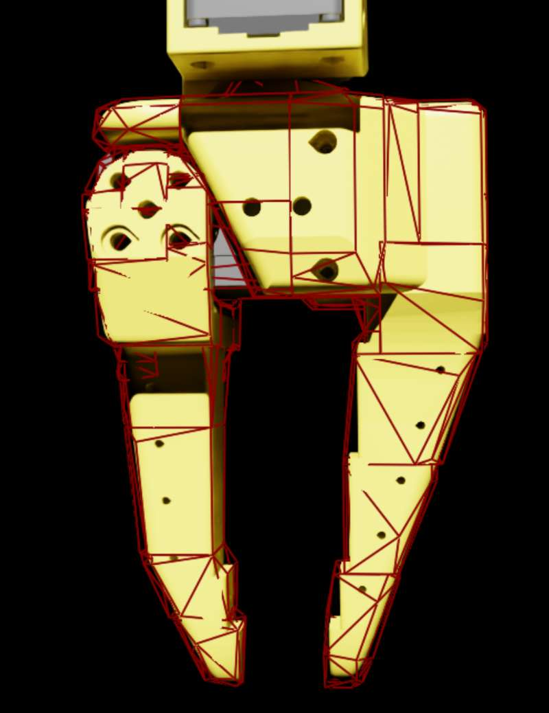

## 概述

在 Isaac Lab（manager-based 环境）中为 SO101 夹爪训练了抓取并托举方块的 RL 策略。

工作包括：
- 报告并协助定位 ROS2 转 USD 的导入问题
- 修复 URDF→USD 后缺失的 `ArticulationRootAPI`
- 用增益调参器调整刚度/阻尼
- 更新夹爪碰撞近似以提升接触稳定性
- 添加材质与摩擦以减少打滑
- 平衡最大力/刚度/阻尼以减小穿透
- 缓解抓取后在目标附近的抖动
- 设计分阶段 reward  schedule
- 提供多轮 TensorBoard 加载脚本便于对比

## 效果
<video src="./assets/success.mp4" controls muted loop style="max-width:100%"></video>

## 详细贡献

### 1) ROS 2 USD 导入问题
  Link: https://github.com/isaac-sim/IsaacSim/issues/261  
- 复现并报告了通过 ros2 节点导入 USD 时的 bug。

### 2) URDF→USD 缺失 ArticulationRootAPI
  Link: https://github.com/isaac-sim/IsaacLab/issues/959  
- 写了如何为 `usd` 资产设置 DefaultPrim 与 Articulation Root 的步骤说明。

### 3) 刚度/阻尼调参
- **精度**：调参后位置更贴近指令。
- **稳定性**：过冲与振铃明显减小。
- **速度**：上升与稳定时间更短。
- **滞后**：指令与观测运动之间的延迟更小。

<table>
  <tr>
    <td align="center"><b>调参前</b></td>
    <td align="center"><b>调参后</b></td>
  </tr>
  <tr>
    <td></td>
    <td></td>
  </tr>
</table>

### 4) 夹爪碰撞近似更新

- 改用更合适的近似：**凸分解**。
- **好处**：更贴合连杆、更少虚碰撞、接触点更清晰、抓取规划更可靠。

<table>
  <tr>
    <td align="center"><b>之前</b>（粗三角网格）</td>
    <td align="center"><b>之后</b>（凸分解）</td>
  </tr>
  <tr>
    <td></td>
    <td></td>
  </tr>
</table>

### 5) 材质与摩擦设置
- 为夹爪与方块指定材质，调整静/动摩擦以限制打滑。

### 6) 最大力/刚度调参的影响

- **调参前**：夹爪抓取方块后会出现小位姿偏差；数值/计算误差下，最大力或刚度越大，偏差越明显。
- **调参后**：偏差肉眼几乎不可见。

    <video src="assets/before_tune_sd.mp4" controls muted loop style="max-width:100%"></video>

### 7) 抓取后抖动缓解
- 进一步调整刚度/阻尼以减轻接近目标时的抖动，并在 play 模式下验证后再跑长训。

### 8) 分阶段 reward 设计
- 顺序：Reach → align → lift → reach，用于加速前期学习并稳定后期精度。

### 9) 多轮 TensorBoard 加载
- 编写脚本加载并对比多轮运行，便于对材质、碰撞近似、增益组做 A/B 对比。

## TODO
Sim 2 Real  
加入相机
