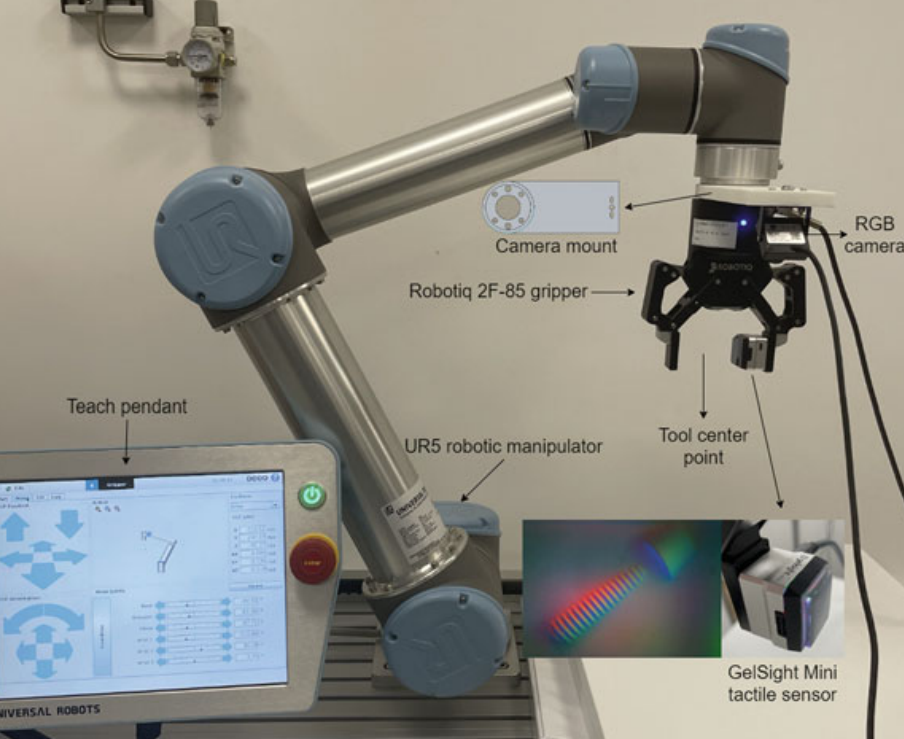
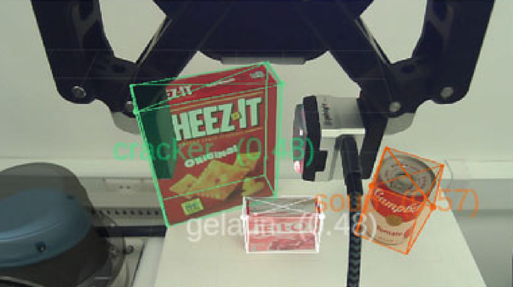
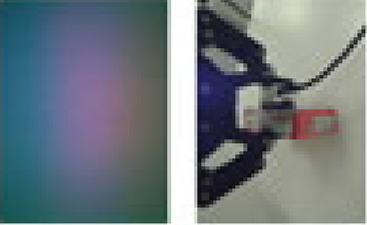
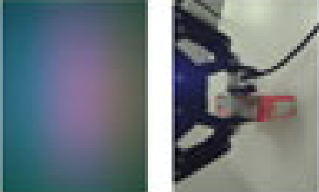

> Combine single-image 6D pose estimation with **GelSight Mini** fingertip tactile sensing to detect slip, surface texture, and contact deformation for robust grasping.

## Overview

This project targets **robust robotic grasping of known rigid objects** by combining:

- A **CNN-based pose estimator** that takes a single RGB image and outputs a 6D pose
- A **GelSight Mini optical tactile sensor** mounted on the gripper fingertip to measure:
  - Local surface geometry and deformation  
  - Surface texture at high spatial resolution  
  - Micro slip and incipient slip during and after grasp closure  

---

## System Architecture

The system consists of:

- A **UR5** robotic arm  
- A **parallel gripper** with a custom mounting bracket  
- An **RGB camera** for single-image 6D pose estimation  
- A **GelSight Mini** tactile sensor integrated on the fingertip  

These components are integrated via ROS to support synchronized data collection and closed-loop grasp control.

---

## Pose Estimation

We use a **VGG19-based network** trained with strong **domain randomization** to perform single-image 6D pose estimation:

- Input: single RGB image from the eye-in-hand camera  
- Output: 6D pose of a known rigid object  
- Domain randomization: randomized lighting, background, and texture to improve robustness to real-world variation  

  
<figure>
  
  <figcaption style="text-align: center;"><em> Pose established result</em></figcaption>
</figure>

---

## Gripper Grasping

During grasping, the tactile images captured by the GelSight Mini clearly reveal the surface texture and local deformation of the object.

To collect labeled data for slip and damage detection, we use the following protocol:

1. **Strong initial grasp**  
   - Apply a large gripping force to firmly hold the object in the air.  
   - Start recording synchronized RGB + tactile video.

2. **Gradual force reduction**  
   - Slowly decrease the gripping force until the object eventually falls.  
   - The entire sequence naturally contains different contact states.

3. **Video segmentation and labeling**  
   - Split each video into three segments, labeled:
     - `damage` – excessive force, visible surface or contact damage risk  
     - `grasp` – stable, safe grasp  
     - `slipping` – incipient or observable slip before drop  

4. **Data diversity**  
   - Repeat the procedure at different **horizontal and vertical velocities** to capture more diverse slip patterns and contact dynamics.

<table>
  <tr>
    <td align="center"><b>Grasping image</b> </td>
    <td align="center"><b>Slipping image</b> </td>
  </tr>
  <tr>
    <td></td>
    <td></td>
  </tr>
</table>

Finally, we train an **MLP classifier** on the tactile features to run at **100 Hz** for high-frequency classification of the contact state.  
For force control, we update the gripping force at **10 Hz**: each control step aggregates the last 10 classification outputs and uses the **most frequent label** as the final decision for adjusting the grasp force.
