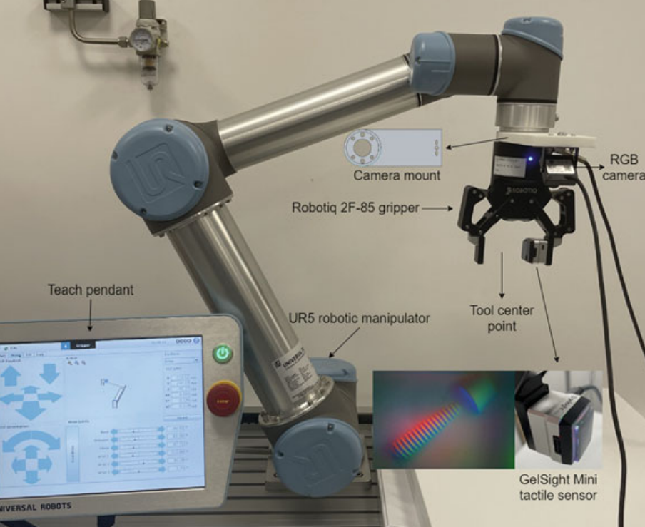
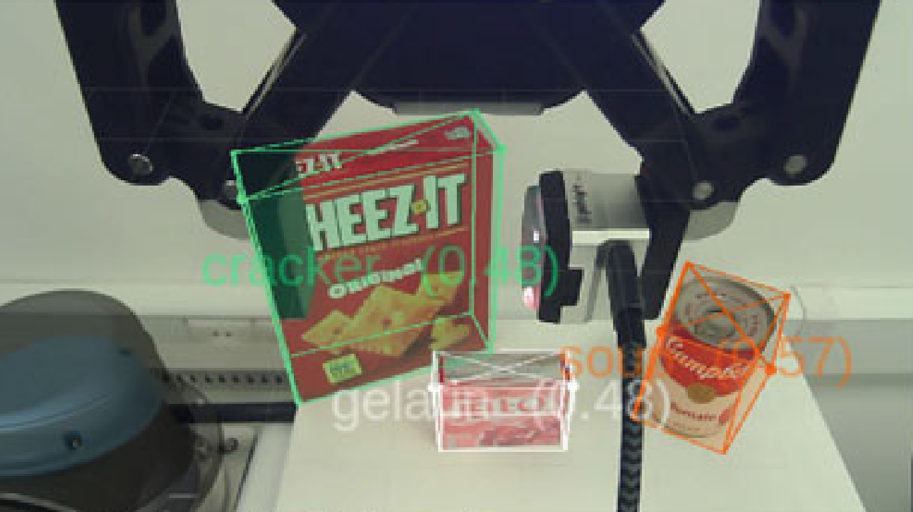
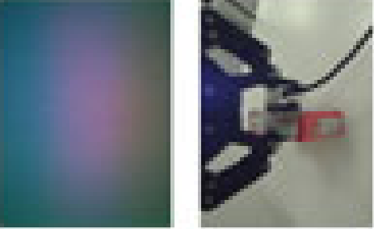
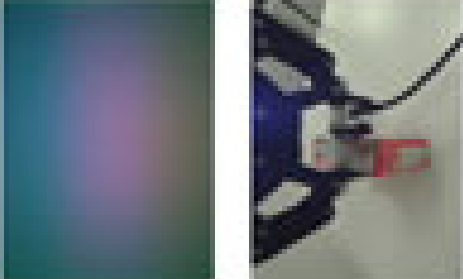

> 将单目 6D 位姿估计与 **GelSight Mini** 指尖触觉传感结合，检测打滑、表面纹理与接触变形，实现鲁棒抓取。

## 概述

本项目针对 **已知刚体的鲁棒机器人抓取**，结合：

- **基于 CNN 的位姿估计器**：输入单张 RGB 图像，输出 6D 位姿
- **夹爪指尖安装的 GelSight Mini 光学触觉传感器**，用于测量：
  - 局部表面几何与变形  
  - 高空间分辨率的表面纹理  
  - 抓取闭合过程中与之后的微滑与初滑  

## 系统架构

系统包括：

- **UR5** 机械臂  
- 带定制安装座的 **平行夹爪**  
- 用于单目 6D 位姿估计的 **RGB 相机**  
- 指尖集成的 **GelSight Mini** 触觉传感器  

通过 ROS 集成，支持同步数据采集与闭环抓取控制。

## 位姿估计

使用基于 **VGG19** 的网络，配合强 **域随机化** 训练，完成单目 6D 位姿估计：

- 输入：手眼相机的单张 RGB 图像  
- 输出：已知刚体的 6D 位姿  
- 域随机化：随机光照、背景与纹理，提升对真实场景变化的鲁棒性  

<figure>
  
  <figcaption style="text-align: center;"><em>位姿估计结果</em></figcaption>
</figure>

## 夹爪抓取

抓取过程中，GelSight Mini 采集的触觉图像能清晰反映物体表面纹理与局部变形。

为采集用于打滑与损伤检测的标注数据，采用如下协议：

1. **强初始抓取**：用较大夹持力将物体稳固握持于空中，开始同步录制 RGB + 触觉视频。  
2. **逐步减力**：缓慢减小夹持力直至物体掉落，整段序列自然包含不同接触状态。  
3. **视频分段与标注**：将每段视频分为三类：`damage`（力过大、表面或接触损伤风险）、`grasp`（稳定安全抓取）、`slipping`（掉落前的初滑或明显打滑）。  
4. **数据多样性**：在不同 **水平与竖直速度** 下重复，以覆盖更多打滑模式与接触动力学。

<table>
  <tr>
    <td align="center"><b>抓取图像</b> </td>
    <td align="center"><b>打滑图像</b> </td>
  </tr>
  <tr>
    <td></td>
    <td></td>
  </tr>
</table>

最后，在触觉特征上训练 **MLP 分类器**，以 **100 Hz** 对接触状态进行高频分类。  
力控制以 **10 Hz** 更新夹持力：每个控制步聚合最近 10 次分类结果，取 **出现最多的标签** 作为调力的依据。
